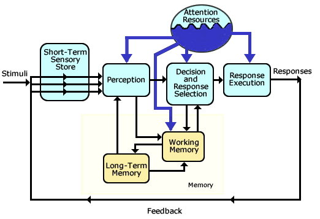

# Cognitive psychology and its applications

First of all, what's the aim of this course?

- What are the **areas** that cognitive psychology can aid?
- **Where in the process** cognitive psychology can help us?
- **How** to apply the methods to solve the problems?

Basically, everything is about interaction between humans and complex systems. We'll be able to practice on these things, and also in presenting analysis of the ideas that are seen. In this intro, we'll quickly cover human information processing (their limitations and peculiarities), eye tracking (useful in measuring human/machine interaction), transportation, distraction, multitasking, decision-making, automation (stress/workload).

A good textbook (way bigger than needed) is _An Introduction to Human Factors Engineering_ by Wickens.

### Evaluation

The assignment is 20% of the grade, then we'll have to present a research problem (20% too) and take an **exam**, which covers 60% of the grade.

### Assignment

The goal here is to practice applying the methods covered in the course, using concrete examples. Some problems will later be explained.

### Presentation

The goal is quite clear: practice applying the knowledge of the course to solve a problem that has to do with human/AI. Choose your own topic, each presentation will take about 20 minutes (15m presentation+5m questions).

### Exam

There are two options at this point, the Uni has not decided yet:

- Normal exam on campus, digital via TestVision with 10 open-end questions (**open book**), checked for plagiarism
- On **Canvas**, analysis of one real-life human-factors problem in which we analyze the problem, identify the possible causes, propose research into causes, suggest a solution and evaluate it
  - No longer than 2 pages
  - Open book
  - Individual
  - Checked for plagiarism

# Introduction to Human Factors Engineering

What is actually **cognitive**? The **Human information processing** model by **Wickens** is a pretty good answer.

Above all these different decision-making stages, there's also a big block called **Attention Resource** (psychological concept) symbolizing a sort of energy that you need for the different cognitive processes. If the juice is low, the system suffers.

We'll use this concept throughout the course.

## Driving

We all do suffer from smartphone addiction, and using a smartphone while driving kills people. This is extremely dangerous, and a system could prevent us from doing that. In the Netherlands, doing that is illegal on bikes too.

There are 40+ companies working on self-driving cars right now.

Even street planning and street signs are interesting to study on this side of cognitive psychology.

## Engineering psychology or Human Factors Engineering

There's an important difference between cognitive psychology and human factors: the first applies **scientific methods** to **understand human cognition** and how it works, helping us understand human information processing. Human factors are used to apply knowledge in the **design of systems** and accommodate limits of human performance, being concerned with **directly applied problems**. It does not always involve psychological perspectives, but physical constraints too.

The intersection is **Engineering Psychology**, which has the aim of not only comparing possible designs, but also specifying capacities and limitations of the human. From these, the choice of a better design should be directly deductible.

The goals are the development of generic knowledge, the increase of efficiency, the increase of safety, satisfaction, the reduction of costs...

We're going to cover human factor cycles (problem-solving and sh\*t), methods that can be used to understand the interaction...

### Brief history of Human Factors Research

Most of this happened during WWII, everybody was building new technology to protect, have advantage, defeat the enemies. During these years, humans were found to be **linked to a machine**: if you had a radar, you searched for a radar expert. Engineers were coming up with all these tech novelties, and the philosophy was _designing a human to fit the machine_ and not the inverse. Lots of psychologists were called to figure out how much information a human can process in a certain period of time: accidents were happening because of distractions while on the job.

The current increase in logical/physical complexity of technology is extraordinary. A lot of decision-making has to happen completely differently. Everything happens at **incredibly high speeds**.

So, how do we cope with this and **understand our limitations**? How do we **design systems** that cope with these limitations?

Humans are more and more viewed as **information processing systems**: there was a shift in Cognitive Psychology which has seen Human Information Processing as very similar to a computer. If you indeed look at the brain, we have systems which are specialized at the input, the output, the processing...

### Why do we need Human Factors?

Accidents due to **distractions** still happen nowadays. For example, airplane crashes are strictly connected with them. The reasons are usually multiple: communication, visibility, attention.

How do we actually design a good system? First, we have to come up with a **prototype** (few ways of doing it, hopefully having some previous research). If you were knowledgeable enough, you could skip some research iterations. This is usually not the case, and multiple prototypes are needed.

Another cycle that the HFE is concerned with is the problem-solving one. We have to view the human as the union of the body and the decision-making. The interaction between human and Artificial System can be measured and _scored_. The engineer will then try to fix these problems, some having solutions directed to the system and some to the human side. For the system you could come up with a better design, equipment, task (all physical things which you can change), but you can also affect how the human is involved (environment, for example light and temperature, selection procedure of the humans, training...).

The problem-solving that Human Factor Engineers can be involved in is often at the stage of prototypes, and the engineer has to provide a fix (which is the most expensive solution): it would be much better to make the HFE part of the team rather than fixing things.

There are two things to be done: performing the **analysis**, and **measuring the performance** of the human.

### Task analysis

This gives us an overview of the range of the tasks that a user performs. In order to really have a good idea about the interaction, you need to write down the tasks that you're doing. One analysis is **physical** (use of tools, instruments) and **cognitive** (you analyze the cognitive processes that are involved).

The first thing to ask is **who is the average user**? How much experience does he/she have?

Then, the **environment analysis**. What kind of airplane is the pilot using? What is the flight distance?

Most importantly, you need to determine **goals**, **functions** and **tasks**. For example, the highest level is the goal, which is _flying the airplane_. Then, the _functions_ (landing, communication, navigation) and finally, the user is involved in different _tasks_ (engaging gears, reducing gears, calling ATC...).

The most important is **understanding the user's goal**.

### Where do we study this?

First, literature study. The next way is **experimental research**, and finally **descriptive research**.

The advantage of the experiment is that it allows you to **establish causal relationships**, as everything (or almost) is under your control, allowing you to isolate things. The situation, though, cannot be realistic enough some times, and the population may not be representative.

Surveys and observations have no way of identifying causal relationship, rather subjective experiences. The reason for this is that humans are susceptible to different biases. Scientists could also misunderstand the users. Finally, sometimes the _optimal solutions_ the users provide may not be optimal at all.

### Benefits of HF

HF can become useful in lots of ways: we may reduce the need for customer support, compensation payments, accidents... Good systems also mean that the employees are more satisfied, productive, less sick...

The costs could be pretty low too, for consultancy and expert reviews. It may be more expensive to involve the HF engineer **from the beginning**, but eventually you'll save money with the second option, as you'll design a better system and not only patch it.
