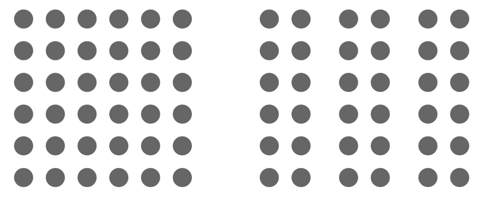

# Human Information Processing

HIP has lots of advantages but limitations too: you can build the best system in the world, but if the HIP cannot process it, you have a useless system.

Our brain has inputs/outputs (for example, eyes process light and information reach the back of the brain, which propagate to other sides of the brain later), specialized areas that deal with these inputs. We also have outputs, like the frontal lobe which is sending signals to muscles. Besides these inputs and outputs, there's lots of processing, and higher cognitive functions (attention, memory, decision-making) are not usually contained in **one specific area**: generally, they are widely distributed.

Some parts of the brain are more involved than others: for example, the parietal lobe has been linked to attention. 

Generally, we'll want to talk about how sensor information is fed to **perception** (first _software layer_ in our brain), i.e. systems that help us to make _interpretations out of information_. After the information is parsed, we can actually process it in detail (selective information) and eventually to decision-making.

Of course, memory allows us to have continuity in our decisions. We have two types of memory, **working memory** (active state, constantly available, like a RAM) and **long-term memory** (indefinite time of storage, very large capacity). Things that we have in memory also **bias** our information processing!

Our system needs **resources** too, some kind of _juice_.

We'll now have a look at the stages: first, **sensory systems** (visual processing), then **attention** (how we select information) and **memory**.

## Sensation

If we look at the light that hits our retina, we can see that only a small portion is actually **visible to us**. We are already imposed some _limitations_, therefore. To do this, we have (most people do) different areas (cones) in our eyes that process different wavelengths. The cones also have a tuning function (they respond to a range, not a specific wavelength). Most people have **three cones**, having **Unaffected Color Vision**, but there's people having **only two cones** (color blindness). When you design a system it's useful to **run it with color filters** to see if colorblind users can see things right. Besides these limitations, we have limitations linked to **how our retina is built**: it is not homogeneous, only in the **fovea** (small portion of the retina) you're able to see **high resolution** and **color information**, as this area contains the highest number of cones. Evolutionary processes are responsible for this: it would really be **difficult to process the whole sight field**, so evolution brought us to have this higher-focus area. At the same time, we evolved a highly performing system that moves the eye to the relevant information pretty fast, without having to think about it.

We have a **blind spot** in our visual field, located about 12-15º. Our brain usually fills it in as it does with colors and shapes.

## Perception

Our perception happens to trick us often.

For example, one would like to know how we reconstruct 3D information from 2D. There's multiple possible answers: accommodation, high convergence (to focus on the object, we move our eyes inwards or outwards) and the most famous one being **binocular disparity** (there's difference in the images seen by the two eyes, as seen in 3D glasses).

Of course there also are **pictorial cues**, often used by artists. One of them is **linear perspective** (you have two lines going away from you, they seem to get near), **relative size** (perspective gives us hints about size), **interposition** (if an object is in front of another, it's closer), **light and shading** (gives us a lot of info about 3D) and **textural gradients** (if you look at the trees they seem to get denser).

### Gestalt laws of grouping

This is really important in software design and UI.

- Law of **proximity**: if you organize the dots differently, the close ones seem to be grouped 

- Law of **similarity**: here, you use contrast, and the dots that are similar in color seem to be grouped. It even works for shapes, colors...

- Law of **closure**: you can clearly see a circle and a rectangle, even if they're not there. We don't need to see the whole object. This is also seen in logos

  

There are others: **enclosure** (if you enclose a subset into a rectangle, it becomes a group), **symmetry**, **continuity** (lines get completed in your head), **connection** and **figure&ground** (people can switch foreground and background).

### Affordances

Another important concept. Right now we were talking about our perception being **passive**, taking sensor input and applying some kind of processing. This is not the case: we are active observers, we move around, we experience different viewpoints and **act to understand**.

We perceive something, and we want to **act upon it** to get feedback. It's also useful for design: for example, color-coded recycling trash cans don't usually work, but a certain opening (e.g. bottle shaped for glass) will. Keep in mind that people want to **interact with things**.

### Predictions

We have been talking about **predictions**: this is probably the most important function of perception. We are so used to processing faces, that we need a small amount of information to process one. Using information from surroundings, we're able to fill what's missing. We can be **primed** by having an immediate experience of seeing for example a human, if we then see a blurred face we quickly notice it.

Up to now we've been talking about vision, but auditory information works the same.

## Attention

When you think about it, we are aware of our surroundings, and we feel like we're not missing anything. **This is not the case**. The trick is being able to tune our attention systems in a way such that we're paying attention to the right things at the right time. The problem is that we have a limited capacity of processing information, so there's a bottleneck in our information process stream.

People tried to define **attention** for many years, but basically we can define it as selecting which information is processed, and which is ignored. How do we actually determine that? To what extent is attention selective? A lot of research comes from _audition_, and a real life example is the **cocktail party problem**: imagine you're at a cocktail party, you're able to focus on the person you're talking to, and completely ignore the others. If somebody all of a sudden calls your name, even though you're in a conversation, you are surprisingly able to hear it instantly. _Cherry_ concluded that if you get different type of information in each ear, one to ignore, the other to remember, when you ask people they cannot report them. A lot of aspects went unnoticed. His work was also used by _Broadbent_ who brought vision into the research: he formalized the _Filter Theory_, stating that you have many types of perception, being able to block some of them and only keep those you need. Is it really an early filter? Do other things slip through? Treisman played a little trick on the Cherry experiment: in one ear she started with "_In the picnic basket she had..._", and the participant reported a mix of the two sentences, starting it with the picnic basket thing though.

Her theory still didn't provide answers to the question _"How's this filter set?"_. Some people proposed that all the inputs are processed, and only later on (when we make choices) we apply attentional selection (_Deutsch & Deutsch_).

We like to pay attention to certain locations (it's easier for us) and put distracting information further away. Sometimes we have to pay attention to different features, such as color, orientation, size...

This is the reason traffic lights work: you're attaching a certain action to a certain color. Human Factor Design has been applied to traffic lights: the green light is always at the bottom.

All these different ways to select information can be quite complex: one task that we're constantly engaged in is **visual search**, for example to find an orange cup on a desk. By doing this research, we can actually figure out how the sampling works. There are two types of search, one is called **feature search** and the other is **conjunction search**. The first is easy: if you're looking for a blue circle, you'll be really quick in finding it if it's unique. There's feature maps in our brain from which we're able to extract features that we need. This is very efficient. If you have to search again for the blue circle, but it's now surrounded by distractors (blue rectangles, for example), you'll find it way more difficult. You'll have to **integrate information from different feature maps**, in this case shape and color!

This task can help us understand **what drives information processing**.

Usually we search for quite complex scenes. In the tulip example, the yellow tulip pops out pretty fast, and our attention is automatically guided to its location. This kind of **guidance** is called _bottom-up guidance_: the scene is guiding your attention towards something, it's not yourself or someone asking you.

Already in the 60s/70s, scientists figured out that there were **feature maps** in our neural cortex (as in neural networks). When you go from the image to the visual cortex, the different maps contain different information: colors, intensities, orientations...

The next step would be integrating all the information into one **master salience map**, which is agnostic to which dimension an item is salient, it just pulls information from the different feature maps.

After you've done all this computation, focal attention goes on from one place to another, scan...

Of course that's not the whole story: we won't look at the tulip forever. If we were asked to look for a butterfly, we would still be pretty fast in finding it. This is known as **top-down**, as we are instructed to look for something.

The difference between top-down and bottom-up is therefore that in the latter, **the scene guides you**.

**Selection history** is about our bias towards the past choices. For example, if in two consecutive experiments, we were first asked to look for a red circle, then in the second experiment we had a red distractor, the second experiment would go pretty bad as we'd still look for the red target and not the real one. The distractor produces a **bottom-up** capture: the person was instructed to look for the real target (_top-down_), but the attention went automatically to the other one.

Recently, a third dimension could be inserted: we're not talking about top-down and bottom-up anymore. The new conceptual model features 3 competing sources: **current goals**, **physical salience** (what was bottom-up before) and **history effects**.

Another important _force_ is linked to **context**: when we know we're in the right context, we know where things are. If we know we parked our car, we won't look for it in the air, just in the parking spots. Context provides you with a certain framework/hypothesis so that you immediately know the expected results.

We can summarize and say that our selection/attention is basically **competition among different forces**: _current goals, selection history, physical salience and scene context._

## Memory

The next cognitive function we'll briefly introduce is **memory**, having its own capacity and limitations.

Things change really quickly, so it would be nice to store information. Research has shown that we first have a very brief representation (short term sensory store) when the information comes in from our retina. That's what we call _iconic memory_, almost as we were taking a [picture](https://media.tenor.com/images/a5172802197a0941aba43de5983bdadc/raw). In order to hold on to that information, we need to encode it: that's where **visual working memory** comes in. The neurons are firing to encode the information. Of course, that's costing us quite a big amount of energy, so we need something which is **long term**, being able to retrieve it when we want it. This is stored in a _passive way_, meaning that we don't actually need to maintain it alive.

The idea of **iconic memory** has emerged in the 1960s, demonstrated by _Sperling_. How did he do that? He very briefly (50ms) presented a matrix of letters to participants, then asking to report which letters were shown. On average, the participants could report about 4. But he came up with something clever: he asked them to report letters from a certain row (asking a given row **after showing the letters**). What he found is that participants were now able to report 3 to 4 letters from _any given row_ (retaining almost all information, 75%). This means that participants still could remember the whole matrix for a brief time, being able to retrieve and store for longer only the letters they needed.

He did experiments to show that the timing from the disappearance of the display and the indication of the row is **critical**: the information starts to decay as soon as its gone from the screen. For the whole report, participants were able to hold on about 4 letters (independent of the delay of the tone, but limited in capacity). For the partial report, participants started off from 9 letters, and if the delay was higher, it dropped off to the whole report capacity.

Unlike sensory memory, working memory is resistant to things like eye movement, blinks, other interruptions...

To summarize, visual working memory is a limited amount of information that is maintained online/readily accessible.

Our brain has persistent and content-specific activity, from which we can actually decode what's happening basing on the active zone:

What's important is that information is **distributed** and **redundant**. Why do we need that? Working memory seems to work as a gradient: depending on the task, we can use different levels of representation. If we need high accuracy, then we may use lower regions of the brain (like visual cortex), but if you have a very complex task (like selection of goals, plans...) then you may actually use higher order brain areas, like movement planning areas. Basically you can use different regions in a very flexible way. This is even **more resistant to interference**: information encoded in the visual cortex is highly susceptible to interference. If distractions come along, how do you hold on to the right information? This is a very highly efficient way of coding information.

Using _EEG_ (ElectroEncephaloGram, in which electrodes are placed on your scalp to get the brain activity) we can measure many things, among which is _Contralateral Delay Activity_. In the pictured experiment, people had to memorize the positions of squares, waited 900ms, then had to remember what changed. In this case, contralateral delay activity it showed that on the contralateral side (left) there was a negative level. If you measure the difference between contralateral and ipsilateral you get these graphs. This marker has been shown to **reflect how many items you are able to hold in working memory**. If you hold lots of items, this activity would be higher. If you then ask participants to maintain more objects in working memory, you'll see that this level does not increase. Based on this, research concluded that **capacity limit** is set at **four objects**. It's probably not about objects, rather about resources you have to maintain in your memory. This is an interesting method that allows you to measure how much information a person is retaining into their working memory.

The last thing we'll talk about is **long term memory**, supposedly having no capacity limitation. An interesting study in the field asked participants to memorize links between different faces and different scenes. They could memorize 3-400 links, telling which face was connected to which scene. What they found is that **hippocampus** was active in this task, but it did not really represent whether the person was correct or not. It would sometimes happen that even though the person gave the wrong answer, the hippocampus triggered when looking at the right one. Hippocampus activation was therefore linked to whether the person **looked at the right person**. Unconscious information can definitely **bias us** in choosing something, even if we don't realize.
