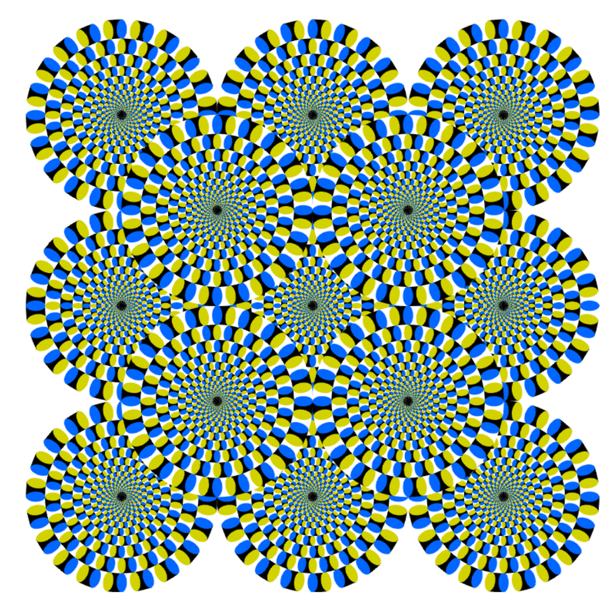
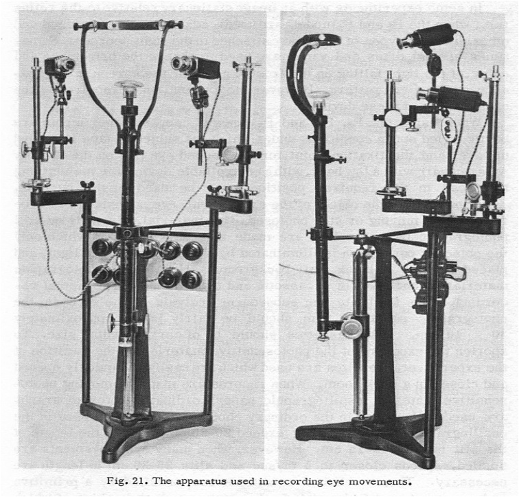
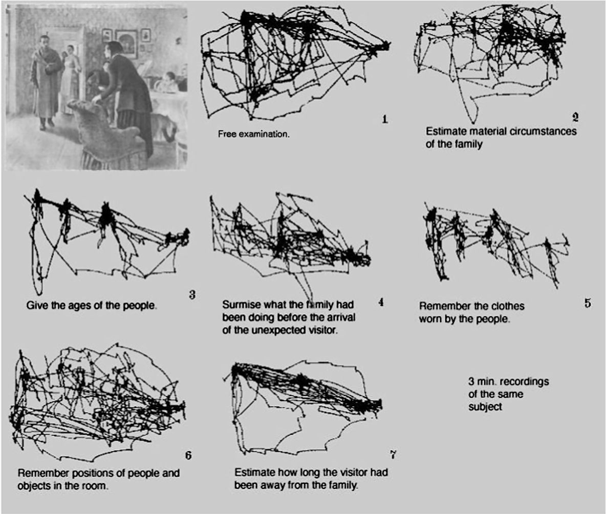
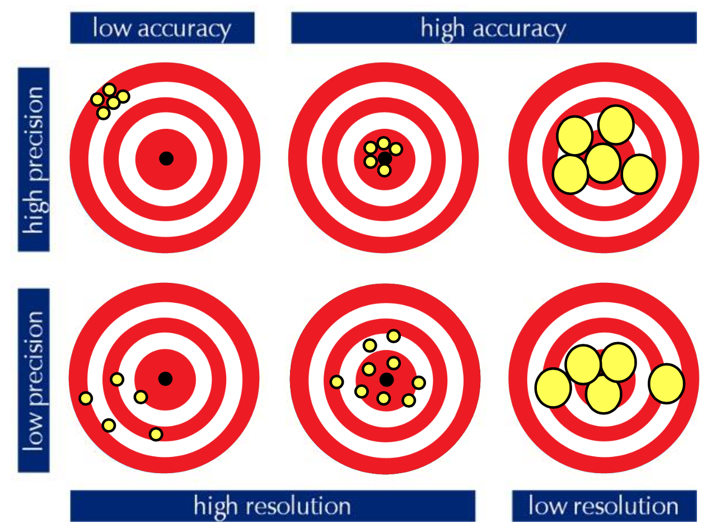

# Eye tracking

Despite what many people think, **eye tracking** is a very complex measure. There's actually a very long history of research in the eye tracking field.

**Saccades** are the most important eye movements, the fastest of human movements.

We can see that the **fovea** is located in the _macula_, and our blind spot is found near the optic disc. The light has to actually travel a lot before hitting the retina and producing a signal.

The outer surface is the **cornea**, the **pupil** is the darker one, the _white thingie_ is called _sclera_ (protein giving the eye a definite shape), and the inside is filled with _vitreous humour_, a transparent type of liquid. It's important to know that the **fovea** is extremely small (1-1.5º of angle) and it contains higher density cones. You have to make an eye movement and focus the fovea on the relevant object.

We were talking about _degrees of visual angle_: we can measure objects using the _metric system_, but it depends on the distance. Closer objects need more space in our field of view. We can capture that by computing the angle, being approximately the ratio between object size and distance.

One degree of visual angle is one centimeter object sitting at 57 cm of distance. This means that we can focus on objects that occupy the same space as a 1 cm object sitting at 57 cm from us.

So, what is actually happening during eye movements? We **don't really see much during these**: they are really fast, and there are even some mechanisms suggesting that we're actively suppressing information to avoid distraction. Experiments showed that flashes presented during a saccade were ignored.

There are actually **different types of eye movements**:

- **Tremor**: basically noise in your muscle control, having high frequency. It is not related to information processing;
- **Drift**: very slow movements while you're fixating a target. Not that informative but may be annoying;
- **Vergence eye movement**: eye movements that direct the eyes towards each other or parallelly to read out depth;
- **Vestibular-ocular reflex**: correcting for head movements, when we're moving our head, our eyes keep go on the other way;
- **Optokinetic reflex**: combination of smooth pursuit (happens when we're looking at moving objects) and saccade (quickly redirecting back). Happens when you're on a train and you look outside;
- **Microsaccades**: kind of like saccades, basically the same but on smaller scale. Happens when, for example, you ask participants to keep the eyes still, and they're not able to;
- **Saccades**: already talked about that :)

If you look at this image, microsaccades cause the movement of the _snakes_, but if you really concentrate on focusing on the black dot, they **stop**.

Our vision is definitely **not passive**: you have to make eye movements in order to see and actively extract information.
With saccades we saw that if you're not fixated at something, you miss information. Even covert attention is active (microsaccades are happening, you're never really completely fixed on something). Some experiments have shown that by stabilizing the eye (using some poison) to avoid every type of movements, the images **fade**.

All of this shows that **visual perception is really critical to our information processing**.

## Eye movements and information processing

We first go back in time to 1967, when an interesting eye tracking book was published. The author _Alfred Yarbus_ invented his own eye tracker (he was an engineer), which was definitely not comfortable: it was a suction cup placed on the cornea, having a tiny mirror on top of it. Participants looked at the image, and the light was shining onto the mirror showing where the person was looking.

What he found was that (as we now know) **eye movements are not random**, as we don't look at every pixel in the screen but rather fixate/focus on specific regions of the image.
He didn't stop there, and in his most famous set of studies he presented people with different famous paintings, with the hypothesis that _if eye movements are related to information processing, they will change basing on the picture_. Participants were asked to do different tasks on the image, like remembering the ages, the clothes, the positions, the objects... Eye movement **changed basing on the task that was requested**.

Yarbus showed that we **do not use saccades** to paint a complete internal representation, we just use them to **sample information** and reconstruct the representation in our head. We are always dealing with a subsample of information. Another thing we can learn is that saccades are the way we select task-relevant information. For example, we notice that when reading our brain focuses _more_ on _content_ words rather than _function words_.

What we also know about **reading** is that distribution of attention is _asymmetrical_: we process more information to the right than to the left, as we constantly pay attention to what's coming next. The opposite is true for arabic/asian countries that read from right to left. We even **regress**: if the reading pace is too high, we naturally re-read things. This also happens when we're searching for something. People vary quite a bit, and regression could also be used to diagnose mental disorders.

When a text is difficult, the size of saccades **decreases**, meaning that you make **smaller movements** and the _**fixation duration** increases_ together with **regressions**: we need **more time**, and we need to **go back** often.

## Eye movement recording

Huey first invented a **mechanical eye tracker** in 1898. With the development of photography, people started to use **images** of the eyes to reflect eye movement (1901), together with a light shining on the eye surface to get the movement. This obviously had to be calibrated. Then, Yarbus (already talked about it). In 1998, they started using **electromagnetic coils** on the eye (the field is distorted by the eye), which are still used. Another one is **EOG** (ElectroOculoGraphy), involving placing electrodes on the head (around the eyes), which takes advantage of the fact that the eye is charged (the back is positive, the front is negative), so when the eye moves it's changing its charge. This is not very accurate, so it's commonly used to check if a person is fixated on a point.

Modern eye tracking is **computer**-based, for example _EyeLink_ is a tower eye tracker (you place your chin in it) using pupil-corneal reflection. In order to use it you have to calibrate it (look at different dots on the screen), measuring the distance of movement of the pupil.

While a lot of eye tracking happens in a lab (this is way more accurate), we are also interested in natural behavior. A lot of progress has been made, and there are eye trackers available that can be used while shopping, playing tennis, driving...

There are important properties in an eye tracker:

- **Temporal resolution**: the higher it is, the better the eye tracker is at catching small movements. This, basically, is just the FPS.
  - The available range goes from 25 Hz(25 FPS) to 2000 Hz;
  - Faster may not necessarily be better: you don't really need 2 kHz for every experiment;
  - In order to get meaningful data you sometimes need to constrain the participant, for example he/she has to stay in a dimly light room;
  - You have to think about which kind of events you're looking to calculate: for fixations you need at least 30 Hz, for saccades at least 120 Hz, for microsaccades at least 500 Hz (the higher, the better).
- **Spacial resolution**
- **Spatial accuracy**
- **Spatial Precision**

Here, you can see in the top left corner a high precision, low accuracy: the bull's eye means that the person has to look for the center, and the yellow dots are what the person is looking at. The high precision states that the yellow dots are not varying much. On the other hand we can have high accuracy and high precision (and that's the best), but we also can have low accuracy and low precision (the worst). You can also have high and low resolution, meaning that your high tracker cannot distinguish between two near points in space.

**How do we actually calculate accuracy?** The participant is asked to look at different dots of the screen (which are the ground truth), you can calculate the offset from that and get the accuracy.

Calibration is the process in which we try to minimize this offset.

To estimate the _gaze direction_ we have two different approaches: **model-based** and **appearance-based**. While model-based methods fit a **geometric eye model** to the eye image, appearance-based methods directly **regress from eye images** to gaze directions using machine learning.

## Eye movement analysis

The simplest way of getting information out of eye movements is **extracting saccades and fixations**.

When you look at a recording, you can see that when a dot is displayed, it takes a little amount of time for the information to reach the cortex, then move the eye. On average, it takes about 200ms to initiate an eye movement. When it starts moving, it actually accelerates/decelerates during the movement, and it's real fast. The thing that we can extract from this is the **latency**. For example, bright flashes receive a quick response (probably some survival response), while other visual inputs could take more (around 300 ms).

Some studies have shown that trajectories are not in a **straight line**, but they are rather curved. You could actually measure attention by looking at how straight the movements are, the more distracted you are, the more you drift away.

Research with doctors looking at x-rays showed that if they were tricked into thinking a patient has a disorder, he will look for that. In the mismatch condition (fake condition told to doctor), they won't actually look at the interesting areas.

What kind of measurements can we introduce?

- Areas Of Interest **hits**
- AOI **dwell time** (time spent on the AOI)
- AOI **over time**, with a plot of the distribution of attention over the area of interest in time

Before actually getting data, you should calibrate. Otherwise, you have a huge bias towards the Areas of Interest you're looking for!

You obviously should not have **overlapping areas of interest**, and their size is important too: a bigger one has higher chance of **random fixations**.

Of course, inaccurate calibration is a danger, and a bigger danger would be fixing it with an offset **after** the experiment.

The things we can further analyze are **scan paths**: there's a certain pattern in how people view images, and you can compare them. It can also be used for **biometrics**. Thanks to Yarbus we know that the scan path changes basing on the task.

How can we **calculate similarity** between scan paths? A simple way is comparing strings: let's say you have a web page, you can label areas of interest and try to align one person to another person. You align these two strings, count how many substitutions you need to make to equalize them. You then divide the number of substitutions by the longest string's length. The similarity will be `1-ratio`.

There are different ways, each having pros and cons. There's a paper comparing them, _AUC, s-AUC, Normalized Scanpath Saliency, Cross Correlation, Earth Mover Distance, Information Gain, Kullback-Leibler divergence (Bylinskii et al., 2017)_. Different saliency models are also available, leading to different saliency maps. You can use these measures to compare scan paths, but even to compare scan paths to the output of saliency models.

You can also try to extract the task another person is doing basing on the eye movements.

There are many applications of high tracking:

- **Medical diagnosis** (how doctors diagnose images);
- **Scientific research**: you can record EEG
- **Marketing and Advertisement**
- **Interface design**
- **Accessibility**: eye tracking is used ad a computer input interface
- **Education**
- **Dyslexia&Autism**: diagnosis and all

## Summary

- We've talked about how **eye movements reflect information processing** over time.

- Bottom-up, bottom-down, prior experience are interesting **bias**
- We have multiple tasks, visual search, memory, reading
- We have seen how we can **record** eye movements
- And how we can **analyze** them
