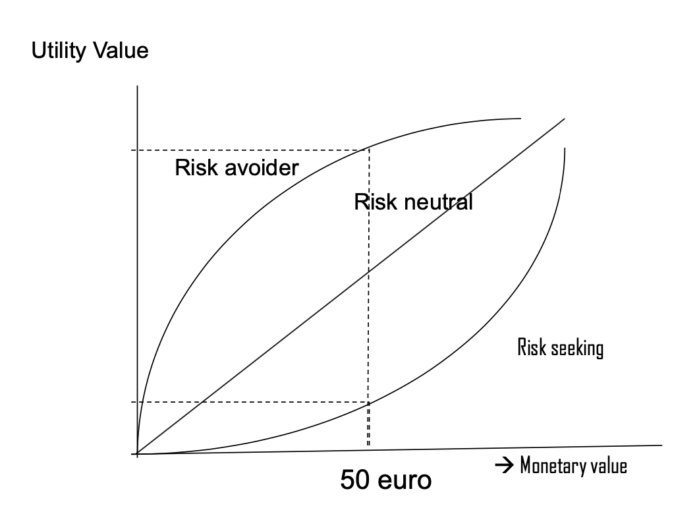

# Decision making

So what's this and why do we want to know it? It's important to understand how we make decisions, as we do that multiple times a day and decisions have consequences too. We'd like to be *optimal decision makers*, but how do we know which is the best for us? There may be systems to aid us in decision making. DM is important in many areas, some of them being more important then others. 

We want to minimize the chance of **making bad decisions**.

**Deciding** is the process of selecting a **response** among several alternatives. Decision is the **outcome** of this process, and it can be good/bad but it's important to separate that from the process: you could have a perfect decision process which still leads to a bad outcome. 

It's important not just to look at the outcome, but at the process. There are different types of decision making, dividable into 3 groups:

- **DM under certainty**: the decision maker knows with certainty the consequences of every alternative
- **DM under risk**: the decision maker knows the probabilities of the various outcomes
- **DM under uncertainty**: the decision maker does not know the probabilities of various outcomes

The **magnitude of the uncertainty** is what separates the last two. 

The **Expected Value** for something gives us a possible outcome: we multiply the possible return by its probability. This doesn't really work: let's say you have to decide between safely getting 1 million or having 50% probability of getting 3mln$. Most people choose the first one, but EV suggests option B.

It turns out that the expected value doesn't really tell us much: people realized that it's not about the mathematical value, but its utility. With money an interesting thing happens: you get diminishing returns, so the value increases at a decreasing rate. This means that if you're really poor and I give you 1000$ the value is enormous, but if you are a millionaire an I give you the same, you don't care. Utility is **not a linear function**, and we have to find a way to estimate it.

You can also make profiles of people based on how they behave, as the utility function may vary from person to person:

## Prospect theory

There's a famous alternative theory, known as **prospect theory**.

They suggested that the preferences do not depend on overall wealth and attitudes, but they are **reference dependent**, as you need some kind of reference point. This depends on how you define your outcomes, i.e. whether you define them as gains or losses. Just like in perception, it all depends on the **reference point**.

They showed that these functions are different by whether you frame things as gains or losses. People are very risk aversive when they're working with gains, but when we're talking about losses, we like risk: we don't like losing our things, so we're okay with gambling.

This is known as **loss aversion**.

Risky prospects can be framed as **gain** or **losses**. 

Daniel Kahneman proposed that we actually have two different reasoning systems, a *heuristic system* and an *analytical system*. The first is considered to be a *pattern matching system*, operating fast, unconsciously, automatically. The second one, is slow, more conscious and reliable. We should be relying on this one.

## Heuristics and biases

Heuristics cover **cognitive biases**, systematic errors in our judgement (being a systematic deviation from the norm). A very large number of these biases have been identified. A lot of research has been conducted to actually find when this happens. For example, **confirmation bias**: you have a theory, you want to prove it, and you're looking at the data knowing what you're looking for. This can lead to wrong conclusions. Another one is **availability bias**, meaning that the already available information we have in our brain is biasing what we see currently. *The probability of an event is evaluated by the ease with which it come to mind*, so we think that **memorable events** are **more frequent**.

An interesting study about this showed that experienced radiologists who were looking for nodules **missed a photoshopped gorilla** in the scans. 

The only solution to this is **slowing down**, not letting our system drive to immediate conclusions. 

Research proved that doctors are **able to diagnose pneumonia** in 15ms. This means that they are **using system 1**. Shouldn't this be wrong? Some of them actually **miss abnormalities** because of this. 

In an experiment, the professor and his team tried to trick radiologists in not finding abnormalities. When there are no abnormalities, the radiologists are good, but when abnormalities are present things get worse: if the description of the image matches the abnormality, they see it, but if not, most of them don't even notice. The same is true for 2 abnormalities, they got even worse results. The experiment was more about getting the time in which they spot the lung problem: within 2 seconds there's a peak (when the abnormality was correct), meaning that they've found it and they're looking at it.

This whole experiment is about proving that system 1 is not that bad, as it gets us to the abnormality real fast. 

Kahneman himself says that errors are both the systems' fault: system 1 generates the error, while system 2 is not able to correct it. 

*Croskerry* suggested that most errors happen in system 1, whereas system 2 error are unexpected. The latter is analytical, slow and resource intensive, but more likely to get the correct diagnosis.

Other researchers have different opinion, for example *Norman* states that errors can be generated by both. *Dhaliwal* stated that **knowledge is king**, as you have to have knowledge to beat errors. If you do not have knowledge on a disease, how can you diagnose it? You can't! You jsut have to invest in developing your knowledge and experience.

Debiasing techniques are often applied generally, slowing down helps.

## Bayes' theorem and medical diagnosis

This theorem applies to these things: when we got tricked by the democrat/republican thingie, we were **neglecting the prior probability**:

*A sample of 999 democrats and 1 republican. 1 randomly selected participant:*

*Russell is 67 and lives in Georgia. He used to work in the oil business and owns a ranch. He believes in traditional marriage.*

*a. Russell is a democrat*

*b. Russell is a republican*

It's really important to know the prior probabilities of tests!

Using AI systems in medical diagnosis is nice, but physicians and copmuters can make different mistakes: together, they could really be powerful. 

There are a few problems in Deep Learning diagnosis: they don't really generalise to other settings (a doctor can go from one x-ray machine to another, while the model was tuned on a single one). The system doesn't really know the context and the prior probabilities, so integration between algorithms and doctors is important.

Finally, **liability** is still a problem.

## Summary

We talked about

- **Decision making**
- **Normative models**: expected value/utility
- **Prospect theory**: reference points
- **Heuristics and biases**: good or bad?
- **Bayes theorem and AI systems**