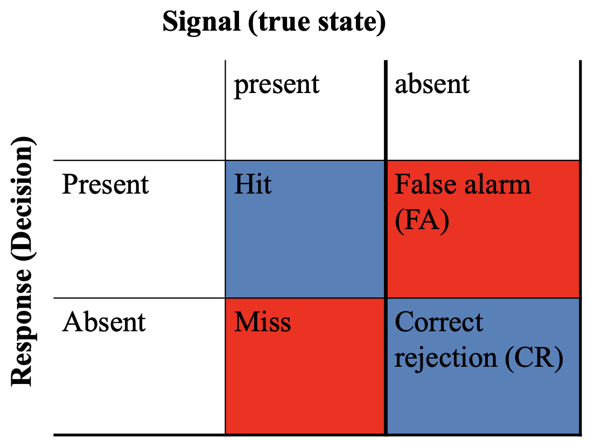
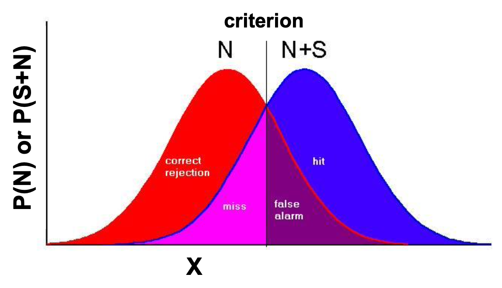
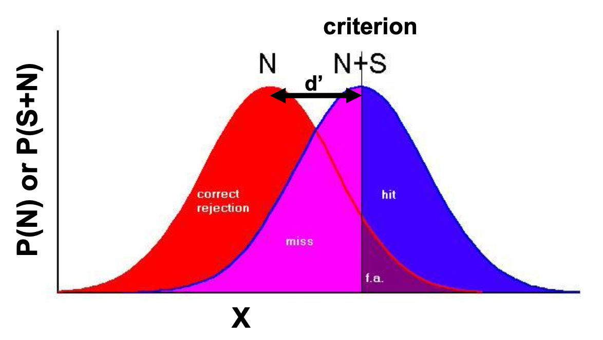
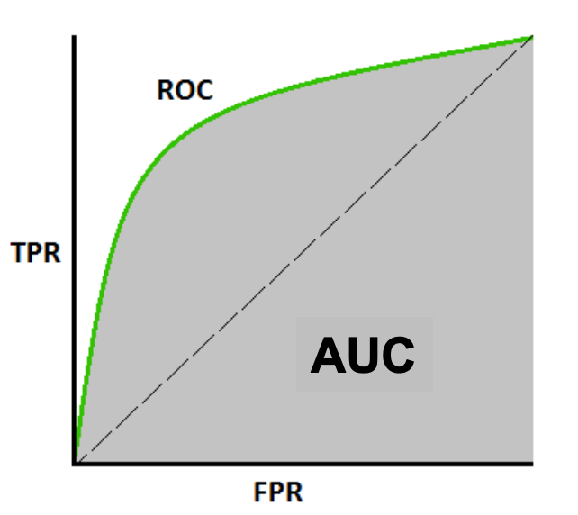

# Bayes' theorem & Signal Detection Theory

These are two different models regarding **decision-making**.

So, what are the strategies that we can use to avoid errors in decision-making? One of these would be applying Bayes' probabilities to do so.

As already mentioned, Bayes' theory was proposed by Thomas Bayes, being a very handy theorem that allows us to express beliefs in mathematical terms.

$$
P(H \mid E)=\frac{P(E \mid H)}{P(E)} * P(H)
$$

This allows us to get probabilities given a **certain observation**.

Remember that it's important to take prior probabilities into account. You should calculate the pre-test and post-test probabilities, as to understand whether you need a test or not and update your beliefs.

## Signal detection theory

This is important in cognitive psychology, providing tools to carry out analysis and understand how people make decisions under uncertainty.

We already talked about what **uncertainty** means: the thing you're interested in is embedded in **noise**. When the signal is much stronger than noise, the task is trivial, but often this is not the case. For example, a doctor diagnosing an x-ray has to check for cancer, and the decision (based on the information) can be a matter of life or death.

Signal detection theory was developed during WW2, when radar operators needed to make a decision.

The question they were asking was whether a radar operator was good at spotting enemies. There are 4 options in this 2x2 table, with 2 states of the world (signal is present, signal is absent). When you make a decision, you end up in either of these 4 squares.

### Assumptions

There are few assumptions to this:

- We have a decision variable $x$, thinkable about _evidence_ or _neural activity_, i.e. everything you use in order to make a decision. This is one-dimensional, if the signal is absent, only noise is in there, while if the signal is present, both signal and noise contribute to it
- Given the absence of a signal or its presence, the value of x varies (non-deterministically, depending on the noise). This variation takes the form of a normal distribution
- Values of $x$ spanning from noise and signal + noise overlap, and that's what makes it difficult.

We have a distribution of noise $N$ and a distribution of $N+S$ (noise and signal), which overlap. The vertical black line is the **criterion** ($\beta$), using it as a threshold. If $x$ is above it, we say yes.

**Sensitivity** is the distance between the means of the distributions, measuring it in terms of **their standard deviations**. To make it easier, we calculate the proportion of hits and the proportion of false alarms, we **normalize it**, and we take the difference.

What happens when **sensitivity reduces**? The distributions **overlap more**, so it will be more difficult to spot hits. That could be because of the signal being weaker, or the observer being worse.

Note that sensitivity is **independent of criterion**.

Criterion setting is **the black line** $\beta$ being a threshold, and the setting of it does not depend on $d'$ in any way. If the criterion is in the middle of the two distributions, we say it's **neutral** (image before the last one). If the criterion is moved to the left, it becomes **liberal**/**lenient**, while if it's moved to the right it's **conservative** (I need more evidence in order to say yes). How do we calculate $\beta$? We just look at the y values and take the ratio.

$$
\boldsymbol{\beta}=f\left(\mathbf{z}_{\text {Criterion }} \mid \mathbf{N}+\mathbf{S}\right) / \mathbf{f}\left(\mathbf{z}_{\text {Criterion }} \mid \mathbf{N}\right)
$$

Note that in the last image, $\beta$ will be above one, as the point in which the criterion intersects che distribution for N+S is higher than the intersection with N.

Note that:

$$
\beta=1 \textrm{ is neutral, }\beta<1\textrm{ is lenient, }\beta>1 \textrm{ is conservative.}
$$

To relate this with other concepts we already know, we can introduce ROC and AUC.

$$
\begin{aligned}
&\text { TPR / Recall / Sensitivity }=\frac{\text { TP }}{\text { TP + FN }} \\
&\text { Specificity }=\frac{\text { TN }}{\text { TN + FP }} \\
&\text { FPR = } 1 \text { - Specificity } \\
&=\frac{\text { FP }}{T N+F P}
\end{aligned}
$$

Note that _FPR_ is **False Positive Rate**, while _TPR_ is **True Positive Rate**. (exchangeable with _proportion of hits and proportion of false alarms_ when talking with psychologists). Note that the curve represents a threshold that is changing. The more _bent_ the curve is, the better it is.

Other measures like _F1_ are available, but we're not gonna talk about their details.

## Summary

- We talked about **Bayes' theorem** and how important it is while making decisions
- We talked about **Signal detection theory**, which was born to solve very practical problems and is now used in a lot of contexts
- We are backed by **Machine Learning** concepts, like the measurement of binary classificators' performance
