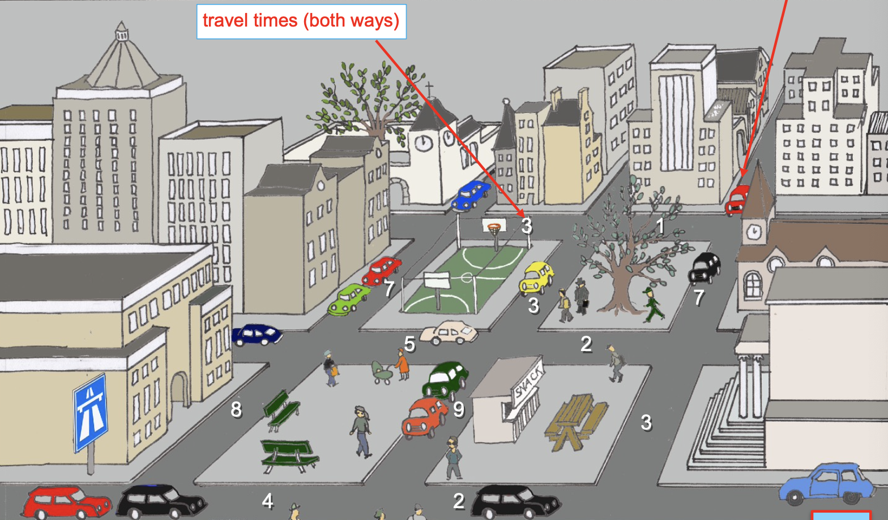

# Dynamic Programming and RL

### Assignments/Grading

The grading consists of two parts. There are 4 homework assignments (most of them are algorithms, some theoretical questions to answer, each counts 10%). You can do them in couples, but for every assigment you'll need to have a different partner. The exam counts for 60% (minimum is 5.0/10)

Lectures will take 2x2x45min. There are TA sessions scheduled on friday morning (2 different times, some on campus some online). Assignments are due 1-2 weeks later. They are published at week 1,2,4,6. 

There's also some overlap in the deadlines. Finally, written exam in week 8.

### Literature

All the content seen in class and in tutorial sessions are what's important for the exams. Optionally, you can read two books:

- Markov Decision Processes by Kallenberg
- 2nd edition of Reinforcmenet Learning by Sutton & Barto

## Introduction to the course

We can see a short map of a city, and we're going to talk about the **shortest path problem**: basically, what Dijkstra solved. We're in the red car and want to get on the motorway, and there are distances. 

You have to make **multiple decisions**, maybe determined upfront but maybe not. Every time you reach an intersection, you need a decision. There are possible *states* (current location), a *time* (measured in terms of steps), and finally, we know the problem is *deterministic*: it is completely predictable, so the *optimal policy* can be computed in advance (**offline**). The algorithms we're going to discuss are **dynamic programming** algos, but other algorithms exist (Dijkstra), even though they are **not generic**.

Let's now look at the same grid, but now there are **traffic lights**: we're inserting non-determinism in our problem. Now, lengths are measured with a random variable: $2+D$ where $D$ is the RV, an unpredictable delay which is either 0 or 5: $P(D=0)=P(D=5)=0.5$.

Commonly, we use the **shortest expected path**. We have a **model for the randomness**: we can compute the optimal policy, as we know the model for the randomness. We cannot predict the exact time, but we can still provide the optimal policy **upfront**. We still call this **offline**.

The algorithm is still dynamic programming, but with expectations included in the right way, and usually the randomness is in transitions and not in the *rewards*.

Now we move on to a third situation: the durations are unknown, not even in distribution (*model-free*). They could be deterministic or random: we just don't know. If you're the first person traveling there, all the roads have the exact unknown duration, but they can be **learned**! By taking a road, its realization becomes known to **future drivers**. How do we include that in the criterion? We could have the first driver travel everywhere to explore, but that wouldn't be optimal. This becomes interesting when we **execute it multiple times**. We can talk about the exploration vs. exploitation tradeoff. We cannot simply use DP anymore: we need heuristics, maybe Q learning, or more mathematical ways like Bayesian DP.

## Key concepts

### Time

We're studying **sequential** dynamic decision making: for every time unit, you make a decision.

The current decision has **direct** (reward or costs) and future **consequences** (future **state**, with its direct rewards...).

### State

State is a concept that **links time periods**. It contains all knowledge needed to predict future behaviour (Markov property, i.e. adding more info does not increase reward). The state could be physical, or maybe just accumulated information. Some examples of state:

- Chess: position of all pieces
- Inventory: items at stock per product
- Autonomous driving: position + direction + speed

The state space is called $\mathcal{X}$.

### Rewards

We have 3 options: *finite rewards*, *long-run average* or *discounted*. Suppose our rewards are repetitive: 1,2,4,1,2,4,1,2,4, what would be the final reward for T=10?

- **Finite**: just sum them, obtaining 10*(1+2+4)
- **Long-run average**: average by time, $3.5*10$
- **Discounted**: with discount factor $\beta \in (0,1): 1+2\beta + 4 \beta ^2 + \beta ^3 \dots$

### Policies

We need some notation, usually $\alpha$ is seen. A policy $\alpha$ determines, for every time and every station, the **action we take**. In other words: $\alpha: \mathcal{X} \times [1,T] \rightarrow \mathcal{A}$.

The **optimal policy** $\alpha^*$ maximizes the total **expected reward**. In certain situations, we do the same for every time step: a policy is said **time-homogeneous** if it **does not depend on time**.

### Transitions

How do we move from state to state? We saw 3 different situations:

- **Deterministic**: we can fully predict, i.e. given we know the policy, evolution in time can be fully predicted
- **Stochastic**: next state is random with **known distribution**
- **Learning**: distribution has to be learned (*implicit or explicit*, with the first)

### Exploration vs. Exploitation

We always have a tradeoff between these.

## Shortest path example, revisited

Now we can talk about this better:

- **Time** is the number of traveled streets
- **States** are represented by the street/crossing we're currently traveling on
- **Rewards** are just $-1 \times distance$
- **Actions** are just where to go
- **Transitions** are deterministic
- **Exploration/Exploitation**: should I try a new road? 

### Inventory management

Customers buy products one by one, orders are placed for replenishment. Orders arrive immediately/after 1+ days, we either (in case of insufficient stock) have backorders or lost sales. We can assume, for now, that orders arrive in 1 day, and sales are lost when stock is insufficient. 

- **Time**: potential order moments (once a day)
- **States**: current stock $x$
- **Actions**: order size $a$
- **Transitions**: we now have a **demand distribution**, i.e. probability that demand is $d$: $P(D=d)$ we have $x \rightarrow max(x-d, 0) + a$ with $a$ being what we ordered. However, if your demand is higher than the current stock, you're losing potential revenue (max between $x-d$ and $0$).
- **Costs**: this is a cost setting, we assume these are modeling choices, suppose that at the beginning of the day you decide whether to order or not (if you do, you pay fixed costs $K$ for shipping), then you have *holding costs* $h$ per item (rent for the building) and *lost sales costs* ($c$ per lost sale)
  - $K I(a>0) + hx + c\sum_{d>x} P(D=d)(d-x)$ with $I$ being an indicator function, i.e. if you order you pay $K$ otherwise you pay $0$, and the final quantity being the cost of lost sales (probability that demand is higher than stock)

### Curse of dimensionality

What if the lead time $L>1$ day? We need to stock in transit (and remember what I ordered, when), and we get a **multidimensional** space in the form $(stock, \# \textrm{arriving in day } i+1, \# \textrm{arriving in day } i+2...)$. This is a problem, as many real life problems have this: Bellman introduced this problem and its solution being **dynamic programming**. 

## Dynamic Programming

Bellman realized the presence of this curse of dimensionality, linked to Markov Decision Processes. Finally, in the 1990s Reinforcement Learning got out, consisting in heuristics for big problems. 

How can we compute these? We have distances $d(x,y)$ between crossings/nodes in a graph. We assume infinite distance if there's no road/arc. We have a very central concept being $v_t (x)$ being the minimal distance from $x$ to destination $s$ in a maximum of $t$ steps. We need to come out with a **recursive way** of computing this function. If we're already at the destination, the value is 0: $v_t(s)=0$ for $t=0,1,\dots$.

No other point can have $v_0(x)<\infty$ for $x\neq s$. **Other values are just composed as $v$ for the current and the next state.**