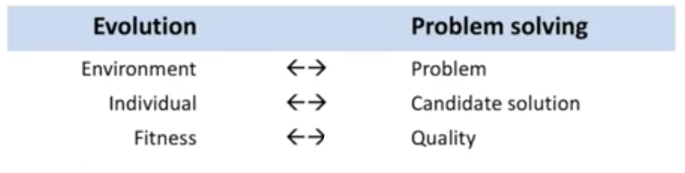

# Problem solving with Evolutionary Computing

This name denotes a field which is concerned with **designing, applying and studying** evolution concepts in computing.

First, **what is an algorithm?** We could say it is _a set of steps to accomplice tasks_. In CS an algorithm is a set of steps for a computer program to accomplice a task. A few famous examples might be _audio/video compression algorithms_, _route finding algorithms_, _rendering algorithms_... Across all the sciences, efficient algorithms are needed to analyze huge datasets. Every area of human life can be aided by algorithms. **What makes a good algorithm**? It has to **solve a problem**, and to do it **efficiently**. How do we measure efficiency? A first answer would be the time of computation, but that would not be computer-agnostic. Computer scientists prefer what is called **asymptotic analysis**, which compares algorithms basing on the number of steps it takes to solve a given input. _(lol sorry this is rather simplistic but it works)_

## 8-queens problem

This famous problem consists in positioning 8 queens on a chessboard without having them interfering with each other. This is an easily explainable problem, but difficult to solve. The example clearly explains the difference between a **problem** and a **problem instance**: the problem is **n-queens**, with _n_ being any number, and a **specific instance** would be, for example, **8-queens**, specifying the number. It's important to note that these are not the same thing.

A first solution would be _placing queens one-by-one_, filling the rows top to bottom, and backtrack if stuck. This is rather slow.

This is _constructive_, as it constructs the solution a piece at a time, _recursive_, and **blind**, as it does not know whether it's about to fail or not.

Let's now consider an alternative approach: it's pretty much the same, but we try to smartly position the _next queen_. For each available position, we choose the one that _checks_ (i.e. covers) the least number of other positions. The two solvers start in different ways, and the guideline is only in selecting a certain position in a row. This is a pretty basic heuristic. The first is said to be **greedy**, the second one to be **smart**.

This second solver is still _recursive_ and _constructive_, but it uses a heuristic.

Now, let's consider another solver which places **all the queens at the same time** (first, randomly), and tries to repair errors by choosing the queen having the highest number of conflicts, and repositioning it in the same row, but in a position that minimizes the conflicts. If we get stuck, we just randomly reposition a queen.

This solver is completely different, as it's not constructive: it always has a full solution, and **iteratively improves it**. It does have a heuristic (improvement by educated guess), and the search trajectory is obtained via **complete** but **incorrect** configurations, while before we had **incomplete** but **correct** configurations.

The last solver is a modification of this: to improve the configuration, we make <!-- $K$ -->  new configurations by a **few random changes** (_mutations_) and we **discard the worst ones**. This method is similar to the third one: it's an iterative improvement method, it has a heuristic and the search trajectory is the same. This method is already **close to an evolutionary computing method**.

## So, what's EC?

We can now say that EC is the **link between problem-solving, and biological evolution.**

For example, we can try to solve the Traveling Salesman Problem. In a biological context we have populations consisting of **individuals**. In the TSP context, each _route_ is an individual! So, rather than a population of rabbits, we have a population of routes. Then, we have to talk about **selection**: in a natural context it is represented by the conditions for which the individuals have to compete, like food, resources, and so on. In the problem-solving context, selection is based on an artificial notion of **fitness**, for example in the TSP we can say that it's related to the length of the route. Finally, **reproduction**: we can develop **digital sex** (_lol_), to mix two (or more!) _parents_, and obtain a _child_.

The **environment** is represented by a **problem**, **individuals** are **candidate solutions**, and **fitness** is transformed into **quality**.

**Fitness**, in biology, determines the chances for survival and reproduction, as quality determines the chances of keeping a solution.

The components are not much: **evolvable objects** (what we do want to have in return, the **phenotype**), **genetic code** (**genotypes**, a representation of the solutions), **reproduction**, for which we'll need a fitness measure and a way of doing selection.

Now, EC is **part of computer science** (or AI), and not **part of life sciences/biology**, even though being inspirational. EC can be applied in biological research (it still needs optimization and modeling), but AI evolutionary processes don't need to be biologically plausible.

There's still some differences between natural evolution and EA: first of all, in nature, the **fitness** is observed a posteriori (i.e. in the eyes of the observer). Rabbits don't have signs stating their fitness. In EA, the user first determines **a priori** how to measure fitness, and that's the way it is. **Selection** is extremely more complex in nature: it depends on the environment, the weather, the food, and viability is tested continually (you can die any minute), while reproducibility is at discrete time (cannot have sex all day!)

In EA **selection** is simply a randomized operator, and parent selection and survivor selection happen at discrete times (you cannot die at any time).

The **genotype-phenotype mapping** (the stage between the reproduction and the birth of the child) is extremely complex in nature, while it's a simple mathematical transformation in EA. Then, **variation operators**: in nature we have sexual/asexual reproduction with at most 2 parents, while in EA we can have any number of parents.

In nature, the process is **parallel** and **decentralized** and birth/deaths are not synchronised (a death does not imply a birth), while in EA the execution is typically centralized.

The **population** in nature is varying in number and has a structure (some individuals fly, some walk, some live in the desert...), while in EA this is usually not true: the population is considered as one undivided set, with a constant size (synchronized death/birth).

We can position evolution in an historical point of view: it's been discovered in the 19th century, _in vivo_ (as in nature), while in the 20th century it was taken to computers (_in silico_), in the 21st century we'll see the transformation of the concept of evolution from software to hardware (_Evolution of Things/in materio_).
