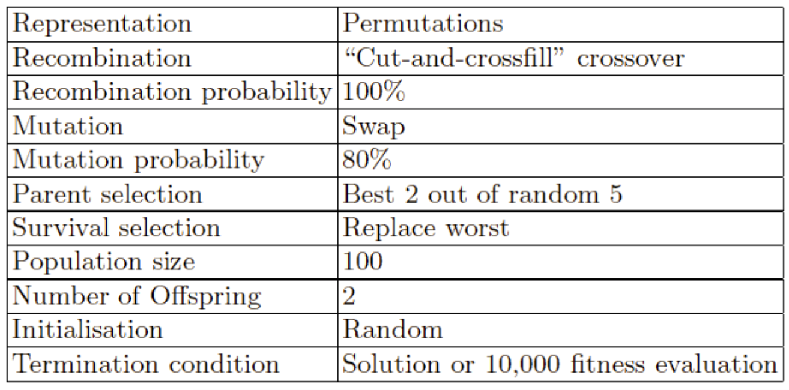

# What is an evolutionary algorithm?

An **evolutionary algorithm** is based on a common model of evolutionary processes, like a **population of individuals**, each of them having a fitness, and a set of **reproduction operators** (mutation/crossover) that create new individuals. The **selection** then operates to achieve a higher overall fitness, through _survival of the fittest_ and _mating of the fittest_.

If you look at Artificial Evolution processes, you can see two forces: one is **increasing diversity** (mutation/recombination, obtaining **novelty**), the other is decreasing it (removing bad stuff by survival/mating selection), pushing towards quality. A good balance between these two forces is essential. It's important to denote that **selection operators** act on population, while **variation operators** act on individuals.

The general schema is the following, having the **population as central element**, containing _n_ configurations for the 8-queens or _n_ routes for the TSP.

The termination happens thanks to some **stopping criteria**. The cycle goes towards 3 different processes: we can **select parents** for reproduction, then apply the **variation operators** leading to a new set of individuals, formerly named **offspring**, having to compete with the existing individuals through **survivor selection**.

The **phenotypes** are the objects in the original problem (for example, 8-queens configurations), the real things we want to encode, while the **genotypes** encode these (as DNA does). This code has to be easily manipulatable. In CS we're used to talking about variables and values, while biologists talk in terms of genes and alleles.

For example, a coding/decoding of genotype to phenotype would be the one in which the phenotype is an **integer**, and the genotype is its **binary encoding**.

Having defined this, we have to specify the **fitness function**, having the aim of replacing the selection role of the environment. Typically, a fitness value could be an integer, a float... It is a good thing to have lots of different fitness values, as to have a wide fitness landscape. Very often we're talking about **maximizing fitness**, but it may happen that we have to minimize it instead. The conversion of a minimization problem into a maximization one is trivial.

We can now talk about **populations**, having the role of holding the candidate solutions (providing a cloud of individuals to climb the hill). This is a **multiset** of individuals (as _it allows repetitions_), and it is the **basic unit of evolution** (the population is evolving, not the individual). Some EAs are indeed _more natural_ in the sense that they embed the population in a spacial structure, but very often the population is unstructured (_every individual can see and mate other individuals_). The diversity of a population is interesting to know: how different the population individuals are from one another. Following biological intuitions, **diversity is good**, as crossover would not return new individuals.

As aforementioned, **selection** has the role of pushing the population towards higher quality. There are two components, deciding **who mates**, and **who survives**. Usually the methods are **probabilistic/stochastic**, as in non-deterministic. This is good because if you only select deterministically, you may get stuck in **local optima**.

There are different implementations for selection, with the most famous being called **roulette wheel selection**: here, the portion of the roulette wheel is related to the fitness of the individual.

Any selection method could be used for either survival and mating selection, but if we're talking about **survival**, it's often seen as a replacement operator: if you decide to keep a fixed population, and only generate 10 individuals and throw away 10, it's conceptually easier to say it's a **replacement** rather than a deletion/addition. This replacement could be fitness based, age based (the oldest generation dies), or a combination of them (stochastic selection for deletion).

The **variation operators** have the role of generating new candidate solutions, moving in the search space. They can be distinguished by their **arity** (number of inputs), where unary operators take one input and produce one output (one parent, one child), binary take two parents, and so on...

**Variation operators must match the given representation.**

The **mutation operators** are unary, and the goal is creating **small, random variations**. The randomness is important as, often, the heuristic mutation operators don't work that well.

The role of **recombination** is **merging information**, as to merge parents into offspring. The majority of the offspring may be worse, or the same, but it may happen that by combining elements of genotypes we obtain good traits. The worsening of the offspring is not bad: we still have selection to care about that.

Finally, we have two important components: **initialization** and **termination**. The first is usually **random**, but it may be done more intelligently, while termination is checked at every cycle, and it could be different depending on the level of knowledge you have about the problem: if you know the optimal fitness, that could be a termination criterion. If you don't have any information, you may set a cap on the computational effort, or stop the algorithm whenever you **lose diversity**.

Putting these all together, you can get different EAs. Often, binary strings are used as **genotypes** (Genetic Algorithms), while real valued vectors are found in the field of _Evolution Strategies_. Finite State Machines are linked to _Evolutionary Programming_, while LISP trees to _Genetic Programming_.

## N-queens problem solution

If we considered the board configuration as the **phenotype**, and a **genotype** consisting in an **array** containing the queen's position in the row, for each row, you could solve it with a Genetic Algorithm. Different variation operators are suitable for different representations.

We can then consider the **fitness** as a score calculated using penalties for each queen that a queen can check, then we minimize this.

The **mutation operators** we can use are multiple, with the easiest one being swapping two values. Crossover may be more difficult (you have to keep the **permutation** property). One way to do that, is, given two parents, we choose a random crossover point, copy the first part into the children, then start filling the empty slots using the other one, but skipping the values that we have already used.

As for selection, anything goes. For example, **parent selection** could be done by picking 5 random parents, and picking the best 2 for crossover. **Survivor selection**, on the other hand, could be done by finding the worst individual each time a new one is added, or maybe remove the best individual that is worse than this child: this helps with variety.

A good summary of what we just said is the following:

## What happens then?

In the first generations, the population is usually **widely distributed** over the whole landscape. Then, selection kicks in and individuals in the lower regions get **replaced** by better ones. In the late stages, population is concentrated on high hills.

Looking at the dynamics can be done by looking at a **progress curve** (or _behavior curve_), in which the vertical axis is the fitness (which may be the average or the max of the population), usually growing quickly at the start, then slowing down (this is said **anytime behavior**, meaning that you can stop it anytime).

Basing on these, we can make some interesting observations on the running time: _is it worse to have long evolutionary processes, i.e. not to stop them early?_ It may be better to divide your effort in having two different evolutions, as it could be that one gives a better result.

Another interesting question would be whether it's smart or not to have a smart initialization. The answer is often no: evolution catches up very quickly, and this may not be necessary.

## A bigger context

Evolutionary Algorithms are not unique, and they stand in a field named _Generate-and-test algorithms_ or _trial-and-error_. They are **stochastic** and **population-based**. Any particular algorithm could be generic or problem-specific. The latter have limited utility, but may perform better.

EAs are **generic**.

We may ask ourselves if it may be good to have **problem-related knowledge** in the algorithm: it is often ok, as it may improve performance in the special case. The performance curve will go higher in the applicable problems, lower in the others.

As for the **global optimization** context (search problem, find a point in a space which is optimal), there are **deterministic** approaches and **heuristic** ones. The latter, often, are faster and more practical: they have no bounds on runtime, and you can stop them anytime, thus having no guarantees on the process. This is often also called **neighborhood search**.

EAs are **different** from these last algorithms because they have a very specific combination of properties:

- They use a **population** instead of a single point;
- They use **multiple search operators** (in the latter, there's only one way of stepping from one point to the other);
- They have variation operators having arity >1, like **crossover**, allowing the combination of information from multiple individuals;
- They have **stochastic selection**.

We may introduce a newer version of the first scheme we have seen in this lesson: this is also a cycle, but has completely different blocks.

## Summary

- There are **different diagrams** that can represent EA schemes, representing different components
- There are **two crucial elements** characterizing each EA:
  - **Variation** operators, pushing towards novelty and having to match the representation (the genetic code, for example the permutation has to stay a permutation)
  - **Selection** operators, independent of the representation, pushing towards quality
- Selection operators work on the **population level** (they compare individuals, there's no individual quality)
- Variation operators act on the **individual level**
