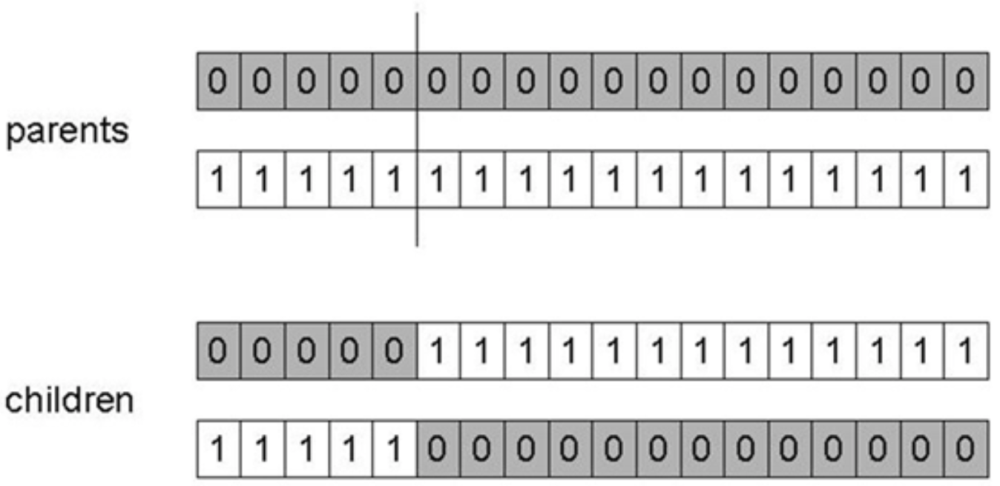
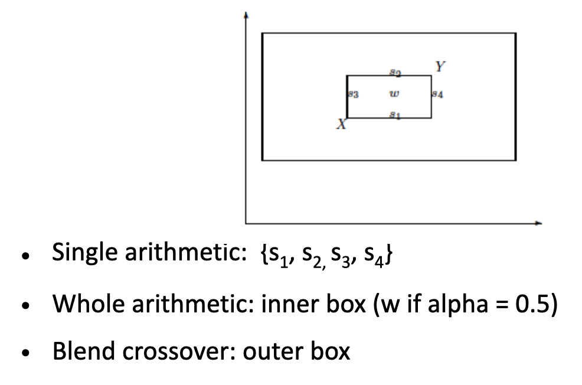
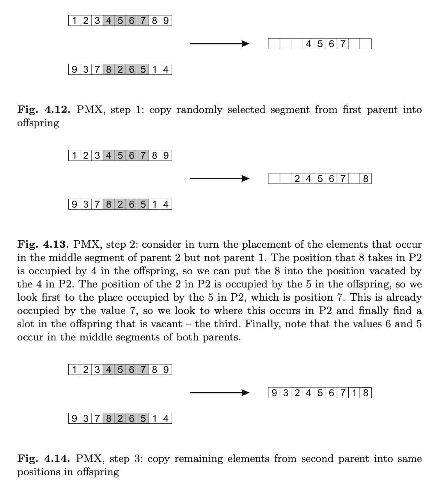
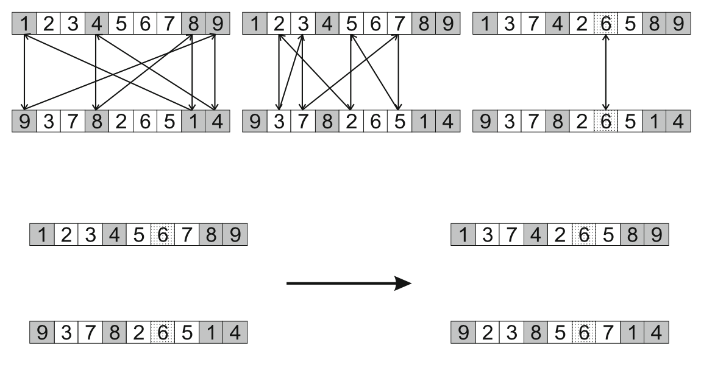
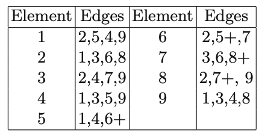
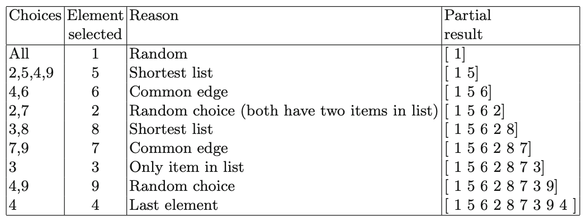

# Representation, mutation and recombination

When you start solving a problem, the first step is finding a good **representation**. Representation is a **mapping** that links phenotypes to genotypes. Representation is often used for the genotype only, but sometimes it represents the mapping too. For instance if you talk about _binary representation_, you're not describing the mapping. This could be specific enough, but may not always be.

An example of these two options: if you think about phenotypes being positive integers, and genotypes being binary strings, you could use the usual binary representation. We though have a problem of discontinuity: if you consider 7 and 8, the integers are near, but the binaries are not. To solve this, you can use another mapping: _gray code_.

This introduces the **strong causality principle**: _small alterations in the underlying structures should only cause small changes to the effect_. If you didn't have this, evolutionary search would just be randomly changing. This makes our *search space* way **smoother**: if that is not true, *anything could happen to the fitness with a small change!*

**Reproduction** is the biological concept (top notion), if it's unary we're talking about **mutations**, while if it's multiple we're talking about **recombination**.

## Binary representation

Now, having a binary representation, we know that each individual has the same length, and the **mutation** is as simple as **flipping each gene independently** with a given probability (hyperparameter to the algorithm). There are heuristics for this: the value should be between `1/pop_size` and `1/chromosome_length`.

A corresponding **crossover operator** is **1-point crossover**: given two parents of the same length, we choose a crossover point, keep everything until the point as it was, then exchange the tails.

The range of crossovers is typically higher than the one of mutations (typically between 0.6 and 0.9).

This type of crossover has a problem/property that keeps the performance suboptimal: it is more likely to keep together genes that are near each other. To solve this, other operators use **n-point crossover**.

Another crossover operator is **uniform crossover**, making an independent choice for each gene. This is entirely free from positional bias.

The debate on which among crossover and mutation is better is still ongoing, but generally we can say that it depends on the problem, and it may be good to have both. There are EA that only use mutation, or only use crossover.

**Exploration** stands for discovery of interesting areas in the search space, while **exploitation** is optimizing within an already found area. In every search algorithm we have to find a good mix of these two.

These two operators have different roles and abilities: crossover is able to **combine information** from 2 or more parents, while mutation is able to **introduce new information**/alleles. Crossover **does not change the allele frequencies** of the population!

## Integer representation

This is a rather straightforward extension, as formally everything had to be converted to binary, but now that's not required anymore. Sometimes the problem needs **integer values**, and these possible values have a natural ordering and a notion of **distance**. In some other cases, you don't have that: for example, when dealing with **categorical values** (colors, for example, don't have a logical order). Having a vector filled with integers is not really different from binary vectors when dealing with operators: n-point/uniform crossover work as previously, while bit-flip can be generalized to random resetting (choosing a new value with a given probability).

New options are also possible: in binary we just had two values, but here we could have values that are close to the original value, introducing a bit-mutation, which keeps the mutation _small_.

Real valued representations are different: very often a problem is defined in terms of real numbers, and the landscape can be depicted in n-dimensions. These integer values could be mapped into a bit string. This operation is bijective: you can go from the integers to the bits, and from the bits to the integers.

You can decide the precision <!-- $L$ -->  for this mapping, meaning that high precision leads to long chromosomes (therefore, slow evolution).

If you want to stick to real values, then the natural choice is using the real value vectors for both genotypes and phenotypes, so the mapping is now an identity matrix. To have floating point mutations, you can get the vector and apply a mutation operator in such a way that the values remain in the upper and lower bounds: <!-- $\bar{x}=\left\langle x_{1}, \ldots, x_{l}\right\rangle \rightarrow \bar{x}^{\prime}=\left\langle x_{1}^{\prime}, \ldots, x_{l}^{\prime}\right\rangle$, $x_{i}, x_{i}^{\prime} \in\left[L B_{i}, U B_{i}\right]$ --> .

For a **uniform mutation**, we could just get the <!-- $x_{i}^{\prime}$ -->  values randomly (uniform) from <!-- $\left[L B_{i}, U B_{i}\right]$ --> . This is analogous to bit-flipping or random resetting.

However, we could have non-uniform mutations: these may be non-uniform for different reasons, such as changing the range, having small perturbations...

The most common method is adding random noise to each variable separately, taken from a **normal distribution**. Given a value <!-- $x_i$ -->  you add some random noise: <!-- $\mathrm{x}_{\mathrm{i}}^{\prime}=\mathrm{x}_{\mathrm{i}}+\mathrm{N}(0, \sigma)$ --> .

<!-- $\sigma$ -->  is called the mutation step-size.

Several mechanisms have been introduced to do this, one of them being **self-adaptive mutation**: we evolve the mutation step <!-- $\sigma$ -->  into the mutation, meaning that this value will change over time. When you decide to use this self-adaptive mutation mechanism, you'll have two values mutating: <!-- $\langle\mathrm{x}, \sigma\rangle \rightarrow\left\langle\mathrm{x}^{\prime}, \sigma^{\prime}\right\rangle$ --> . You'll have to choose an order: first mutate <!-- $\sigma$ -->  then <!-- $x$ -->  with the new <!-- $\sigma$ --> , or the inverse? Remember that <!-- $\sigma$ -->  does not have any fitness measure. This is the reason we **first mutate** <!-- $\sigma$ --> , then <!-- $x$ --> : we can only discover if the mutation was good after this last step.

So, the normally used mechanism is called **log-normal mutation operator**. We now have an additional parameter <!-- $\tau$ --> , the **learning rate**, and a **boundary rule** <!-- $\sigma^{\prime}<\varepsilon_{0} \Rightarrow \sigma^{\prime}=\varepsilon_{0}$ -->  meaning that if the sigma value is too close to 0, you push it up.

Now we can extend this mechanism and introduce several mutations at cycle at every coordinate, meaning that the chromosome values will double: for each <!-- $x_i$ -->  you will have a <!-- $\sigma_i$ --> . You then have to extend the formula that defines the new sigmas, having two learning rates: the first one is the same for all coordinates (coordinate-independent), while the second one depends on the coordinate. This only influences the computation of the **sigma value**. If you use this, landscape directions can now have different probabilities.

This will not hold for the last version: **correlated mutations**. this makes chromosomes even longer: we add <!-- $k$ -->  new parameters (where <!-- $k=n\frac{(n-1)}{2}$ --> ). You then have to extend the formulas: you change the <!-- $\alpha$ -->  values too now, and you calculate <!-- $x'$ -->  using the **covariance matrix**. This is popular: CMA-ES (Covariance Matrix Adaptation Evolution Strategy) is one of the best EAs for numerical optimisation.

**Recombination** is less complicated for integer representations: we can do whatever we were doing before with **discrete recombination operators** (wach allele in the offspring comes from one of the parents with uniform probability). However, having real values gives us new options, for example **picking the averages**. There are a lot of operators that do this. First of all, the **single arithmetic crossover** picks a single gene at random. The **blend crossover** takes the new value from an interval which is **larger than the one found in the parents**. 

As afore-mentioned, crossover operators have traditionally been binary, but the possibilities in Artificial Evolution are infinite.

One of the easiest generalisations of n-point crossover is **diagonal crossover**: for n parents, the operator creates n children by composing n children from the segments and composing the children from the diagonal.

Another kind of operator is **arithmetical crossover operator**: if you have `n` parents, you can just average each allele among all the parents.

## Permutation representations

**Permutations** are mathematical constructs that may, for example, represent the TSP. Generally speaking, there's lots of problems that can use these, usually problems requiring an order of choices. Using permutations introduces new problems: normal mutation operators could create non-admissible solutions. If you change a value just in one place, that might become doubled.

**Mutation and crossover have to be designed differently.**

### Partially Mapped Crossover

For example, **Partially Mapped Crossover** is a good solution, and what it does is the following:

- Chooses 2 crossover points at random, copies the segment between them from the first parent to the first offspring;
- Starting from the first crossover point, it looks for elements in that segment of the second parent that have not been copied;
- For each of these (_i_), look in the offspring to see what element (_j_) has been copied in its place from P1;
- Places _i_ in the position that was occupied by _j_, since we know that we won't be putting _j_ there;
- If the place occupied by _j_ in P2 has already been filled in the offspring by an element _k_, puts _i_ in _k_'s position;
- The remaining positions can be filled from P2.

### Cycle crossover

In this type of crossover, given two permutations, we try to find cycles and swap these.

- Identify cycles putting the two parents in front of each other, then move from top to bottom

  - For example, you get the first position (1), then you go down straight, finding a 9
  - You go to 9's position in the top one, then go straight down and find a 4
  - Go to 4's position in the top one, then down straight
  - Find an 8, move to the upper 8, then straight down
  - You find a 1, and arrive back to the position 1.
  - **You found a cycle.**

- You do the same again starting from the second element.

- Copy alternate cycles into offspring (the first one goes in the right order, the second one is inverse...)

  

### Edge crossover

This is based on the idea that offspring should be created as far as possible using only edges that are present in the parents. What you're about to see is _edge-3 crossover_, an often used version.

For this operation, an edge table is constructed, which **for each element** lists **the other elements that are linked to it** in the two parents.

- Construct the edge table;
- Pick an initial element at random and put it in the offspring;
- Set the variable `current_element=entry`;
- Remove all references to `current_element` from the table;
- Examine list for `current_element`:
  - If there's a common edge, pick that to be the next element;
  - Otherwise, pick the entry in the list which itself has the shortest list;
  - Ties are split randomly.
- In the case of reaching an empty list, the other end of the offspring is examined for extension; otherwise a new element is chosen randomly.

For example, if we had the same parents as in PMX `[1,2,3,4,5,6,7,8,9]` and `[9,3,7,8,2,6,5,1,4]`, the table would work as follows:

And then, the recombination is the following:

## Tree representation

**Trees** are very powerful representations: for example, they can be used to encode arithmetic formulas, logical formulas, programs...

Up until now, we have seen chromosomes with **linear structures**. Now, trees allow us to have non-linear ones, having variable depth and width.

This means that you'll have variable size chromosomes. The formal definition needs symbolic expressions first, which can be defined through their **terminals** (terminal set `T`) and the **functions** (function set `F` together with arities).

Having defined the language, you can define the set of **correct expressions** as:

- All the terminal symbols `t`
- All functions `f(e_1,...,e_n)` having the right arity and `e_1..e_n` are correct recursively
- There's no other form of correct expression

We can now define **mutations**: the most common is as simple as selecting a **random position**, and replacing that subtree with a **random** one.

Mutation has two parameters: the probability of a mutation, and the probability of choosing an internal point as the root of the subtree. Usually, the first one is advised to be 0 or very small (0.05 or something).

As for **recombinations**, the same things hold as before: we have two parents, exchanging two randomly chosen subtrees among the parents. You have two probabilities as parameter: the probability <!-- $p_c$ -->  of choosing a recombination, and the probability of choosing an internal point within each parent as crossover point. Notice that the **crossover could increase the size of the individuals**.

## Summary

- Representation is a **critical decision**, probably the most important: if you choose the wrong one, you're due to fail
- A handful of data structures are enough to represent a lot of problems
- For any given problem there could be multiple possible representations
  - To decide the best one, always think about the **strong causality principle**
- Reproduction operators **must fit the representation**, they're stochastic, and can be distinguished by arity
- **Self-adaptive mutation** is powerful!
