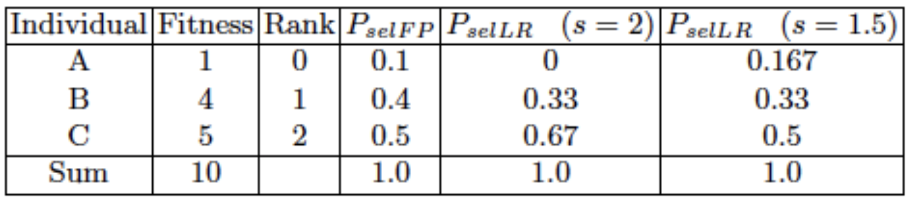
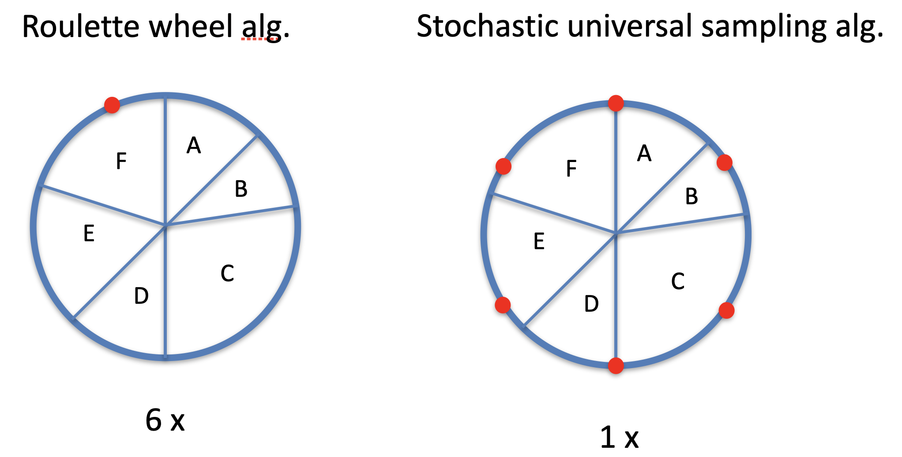
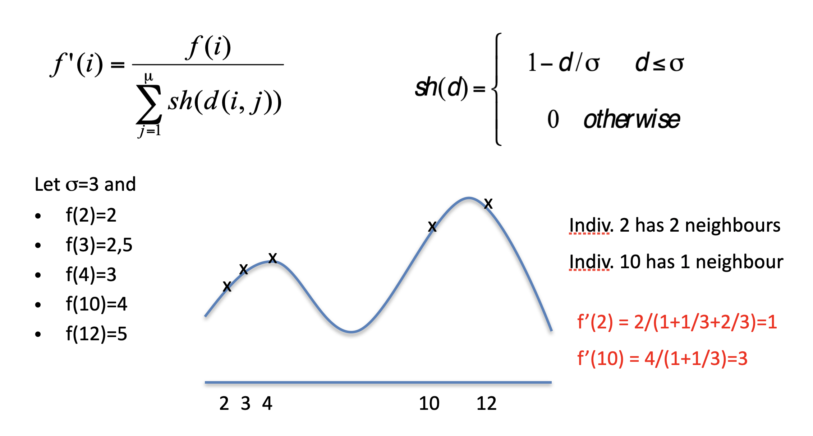

# Fitness evaluation and selection operators

This will be shorter than usual: there are not many available options for these operators.

As we already know, **selection** is one of the two fundamental forces, being concerned with increase of quality and decrease of diversity.

## Population management

In principle, there are two different population management models: the **generational** one and the **steady-state**. In the first one, we have _clear_ generations, which are not overlapping: the entire set of parents is discarded, and the offspring totally replaces the population. The latter keeps a part of the population, only replacing a part. This is _smoother_, and introduces a new concept, the **generation gap**. This is the **proportion of the population that is being replaced**, which, if equal to 1, is the same as a _Generational EA_.

We have **two possible selections**: **parent** selection and **survivor** selection, and both are independent from the representation. As for selection, we can distinguish between **selection operators**, that define selection probabilities, and **selection algorithms**, which define how these probabilities are implemented. This distinction isn't always relevant, though.

## Fitness-Proportionate Selection (FPS)

We have already seen this: the selection probability for an individual $i$ to be selected for mating is its fitness value divided by the sum of the population's total fitness: $P_{F P S}(i)=f_{i} / \sum_{j=1}^{\mu} f_{j}$.

This is one of the oldest mechanisms, but it has a couple of problems. First of all, **premature convergence**: highly fit individuals can rapidly take over, before a real optimum is found. This leads to **local optimums**. The second problem is the **loss of selection pressure**: as evolution goes on, the selection values go up and there will be small differences in the fitness values, which will make selection probabilities highly similar to one another. Finally, this is **highly sensitive to function transposition**. Let us consider a small population of 3 individuals, having fitness values of $1,4,5$ respectively. For this mechanisms, the selection probabilities are $0.1,0.4,0.5$. Now, if we transpose this fitness function and push it up by adding $0.1$ to each of them, and calculate the selection probabilities we get $0.275, 0.35, 0.375$. Pushing this landscape even higher, we almost get the same probabilities for them.

There are mechanisms that have been invented to keep the proportions, while recalculating the fitness functions:

- **Windowing** consists in subtracting the **worst fitness** in the generation from all the values
- **Sigma Scaling** replaces the fitnesses with a value consisting in the maximum between 0 and the subtraction of the average fitness and the standard deviation of the fitness multiplied by some constant $c$:

$$
f^{\prime}(i)=\max \left(f(i)-\left(\bar{f}-c \cdot \sigma_{f}\right), 0\right)
$$

where $\bar{f}=$ the populations avg fitness, $\sigma_{f}=$ st. dev., $c$ is a constant, usually 2.

This means that if an individual has a fitness that's the lowest, it could be allocated with fitness=0.

## Rank-based selection

This is a completely different mechanism: rather than using the absolute fitness value, we're using relative fitness values (or ranks). We rank the population according to fitness in a certain way, such that the worst individual is ranked $0$ and the best is $\mu-1$ with $\mu$ being the population size.

### Linear ranking

There are different mechanisms: the first we'll talk about is **linear ranking**, which gives a probability equal to:

$$
P_{\text {lin-rank }}(i)=\frac{(2-s)}{\mu}+\frac{2 i(s-1)}{\mu(\mu-1)}
$$

where $s$ is an hyperparameter measuring the **advantage of the best individual**: $1 < s \le 2$.

If you compare FPS and Rank-based Selection, you get way different results:

### Exponential Ranking

The difference is that now the formula is not linear, but exponential:

$$
P_{\text {exp-rank }}(i)=\frac{1-e^{-i}}{c}
$$

This one can be much more **biased towards quality**.

## Selection algorithms

We already said that **selection algorithms** and **selection operators** are different. Using a **roulette wheel**, we get two different probability circles, but actually selecting the individuals can be done in different ways. On the left hand size, you see a mechanism that just has one ball in the roulette wheel, and spins the wheel 6 times. On the right hand size, you have 6 balls, and you spin the wheel once.

### Tournament selection

This is different, as all the previous ones rely on **global population statistics**, meaning that we have to know the fitness of every individual. The mechanism is simple: we **pick** $k$ individuals completely **randomly**, and depending on how good these are, we select **the best of them**.

Tournament selection is good because it allows you to scale the selection, which can be fast or slow depending on how many individuals you need.

### Uniform

There is also a mechanisms which is completely fitness-agnostic, allocating the same probability to each population member: $P_{\text {uniform }}(i)=\frac{1}{\mu}$.

# Survivor selection

**Survivor selection** means that we already have a population and an offspring, and given these two sets, you have to select those that will make up the next generation. This can be based on different principles, either looking at fitnesses or maybe just at the age.

If you have _fitness-based_ survivor selection, you can do lots of things: for example, you can apply **elitism**. This mechanism guarantees that you never lose your best individual, or even decide to keep the best $n$ individuals. You could also look at those that you **delete**: for example, deleting the **worst individuals**.

A mechanism that is more similar to _Tournament Selection_ is **Round-robin tournament**: if you have new parents and $\lambda$ offspring, you do pair-wise competitions in such a way that each individual in these sets is compared with $q$ other randomly chosen individuals. For each comparison, you can have a win or lose basing on the fitness. After all these competitions, you count the wins and rank the participants, keeping the $\mu$ best individuals. The parameter $q$ allows you to tune the selection pressure.

Other interesting fitness-based survivor selection methods are the $(\mu, \lambda)-$ selection (read as _mu comma lambda selection_) and the $(\mu+ \lambda)-$ selection (_mu plus lambda selection_), which are different in whether or not the offspring population is taken into account. In the _comma_ strategy, you select the new survivors out of the $\lambda$ children and only select the best. In the $+$ case, you select the best ones out of both the sets. Usually, the _comma_ form is preferred as it's able to **forget**: this helps in leaving **local optima**, and it's good in following moving optima. The + strategy is definitely not a good companion to **step-adaptive mutation**, as it allows bad $\sigma$ values to survive for long if the $x$ values is good (take a look at chapter G).

In these strategies you always have a decision to make, which is _how many children do we make?_ Usually, $\lambda \approx 7 \cdot \mu$, even though lately approaches with $3$ have been observed.

### Selection pressure

**Selection pressure** can be measured using the **takeover time**. This is the number of generations it takes for a population to become completely uniform. This means that if I have a population and don't apply mutation and crossover, I check how long it takes to get to a uniform one. Theoretical studies have shown that evolution strategies and genetic algorithms vary a lot in this. For an evolution strategy with $\mu=15$ and $\lambda=100: \tau^{*} \approx 2$ , while for a genetic algorithm with proportional selection it's $460$.

## Preserving diversity

### Multimodality

An important notion related to selection and fitness evaluation is **multimodality**: this refers to the **number of hills** in the fitness landscape. A multimodal landscape has multiple hills, of which you'll want to find the highest. The typical behaviour in these landscapes is that sooner or later, we'll converge to one optimum. This is not always desirable: you may want to have different optima and keep diversity. **Losing diversity is always bad**: there are mechanisms to avoid doing so. These can be classified into **explicit** and **implicit**. The first are always based on **competition**, sometimes **direct** or **implicit** for resources. The latter try to **segment the population**, maybe due to geographical separation or an equivalent of speciation.

### Explicit approaches

The first of these is **fitness sharing**: it tries to have an individual share its fitness to a niche, and tries to allocate individuals in proportion to niche fitness. This pushes the fitness of individuals that are _alone_ in their neighbourhood. For this, we have to define a **niche size**, by defining a distance between individuals (in their genotype or phenotype space), then redefine the fitness of individuals within one niche. The fitness of an individual is divided by a sum, which is calculated with a share related to the **distance**:

$$
f^{\prime}(i)=\frac{f(i)}{\sum_{j=1}^{\mu} \operatorname{sh}(d(i, j))} \quad \operatorname{sh}(d)=\left\{\begin{array}{c}
1-d / \sigma \quad d \leq \sigma \\
0 \text { otherwise }
\end{array}\right.
$$

The share is calculated for the individual's niche _friends_ only. If we had $sh(d)=1$, it would just be a count of the individuals in the niche. Note that the distance to itself is 0, so the denominator will always be $\ge1$.

Note that the reduction for 2 is bigger than the one 10 has.

**Crowding** is another approach: it tries to distribute the individuals evenly among the niches, basing on the assumption that children will be close to parents. It uses a distance metric in either the phenotype or genotype space, taking two parents and 2 offspring, then making a _small tournament_ which sees one parent competing with a child, the other one with the other. To find these _families_, we have that $\mathrm{d}\left(\mathrm{p}_{1}, \mathrm{o}_{1}\right)+\mathrm{d}\left(\mathrm{p}_{2}, \mathrm{o}_{2}\right)<\mathrm{d}\left(\mathrm{p}_{1}, \mathrm{o}_{2}\right)+\mathrm{d}\left(\mathrm{p}_{2}, \mathrm{o}_{1}\right)$.

We have two parents, and two offspring, then we number the two parents and offsprings such that the distances are as defined above. 

The difference between these two approaches is the following: in _fitness sharing_, we'll see a higher number of individuals in the highest hills, while in _crowding_ the individuals are spread evenly throughout the hills. There is no general-purpose answer to *which is better*, you just have to try them and check the performances during *preliminary testing*.

### Implicit approaches

The first implicit approach we'll see is based on some kind of **speciation**, meaning that mating is restricted to **similar individuals**. It could be defined by a genotypical or phenotypical similarity, based on either some _distance measure_ or even defined on some genotype additional tags that are then involved in parent selection.

A completely different approach is based on **island models**: we distribute the population over islands, which develop independently for a given number of generations. After this _epoch_ (given number of generations), we stop and mix the individuals from one island to another. This has some parameters (hard to optimize):

- How often to exchange individuals
- Too quickly will lead to the same solution for all islands
- Too slow will waste time
- Most authors use 25-150 generations
- It may be done adaptively, maybe basing on a _no-improvement trigger_
- How many, and which individuals to exchange
  - Usually, only a few individuals migrate
  - We can **move** an individual or **copy** it
  - As for which individuals to migrate, we might be interested in migrating the best ones, but the best choice will probably be a random exchange, or a **selection by diversity** (the individual bringing the most novelty to an island)
  - Islands don't have to act by the same mechanism: you could use different setups in different islands

**Cellular EAs** are another approach, working with a spacial component. You superimpose a **grid** on the population (often rectangular), and place each individual on this grid and define the neighbours. The idea is that selection has to be restricted to neighbours. The equivalent of 1 generations is that we pick an individual, we look at the neighbours on the grid, choose one using a roulette wheel, crossover, mutate, and replace the parent with this individual if it's fitter. You then repeat this on the whole grid.

## Spaces

Selection operators and diversity preserving operators often rely on **distance**: it is very important to notice that there's many spaces which we can measure. For many EAs, we can use the genotype space. The phenotype space is also possible, and it could have a completely different neighbour structure. We may also use the **fitness space** (the quality can be used to form a space in the landscape). Finally, the **algorithmic space** is completely artificial, based on the structure of the population.

## Summary

- Selection is the operator that increases quality, decreasing diversity
- Selection takes place in **two different steps**: _parent selection_ and _survivor selection_
- A particular selection operator could be used for **both**
- **Selection pressure** is important: if it's too strong, we may go towards local optimums, if it's too weak, we may degrade to random search
- **Diversity** is crucial, and there are mechanisms available to preserve it

Note that **fitness function** and **objective function may not be the same**: for example, you could have an objective function that you want to transform to get a more stable, more interesting, easier fitness function. They tipically are the same, as you want to optimize the objective function, but don't take that for granted.
