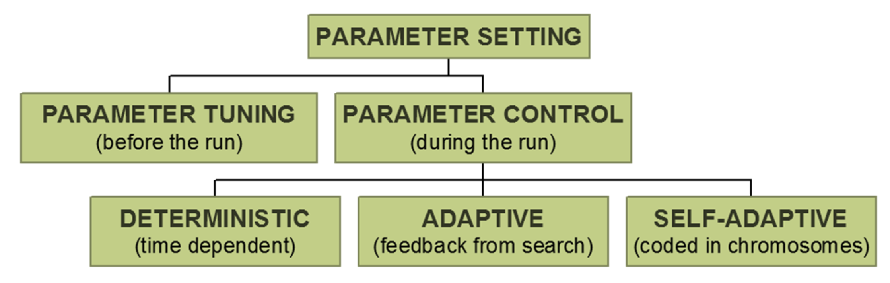
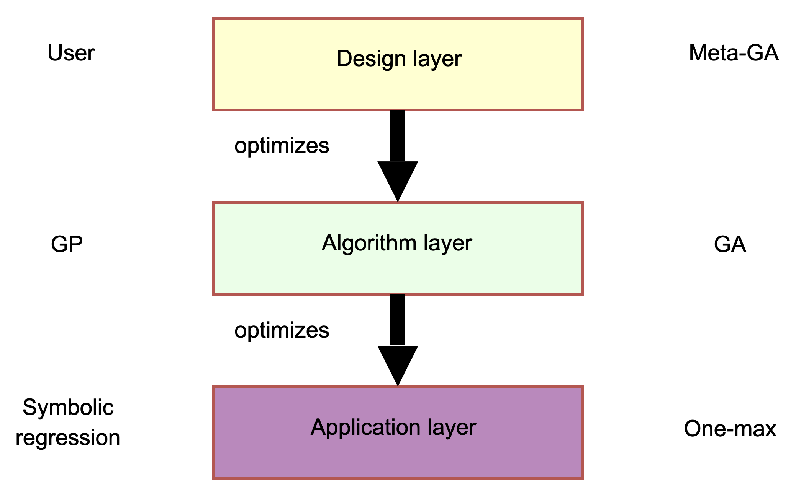
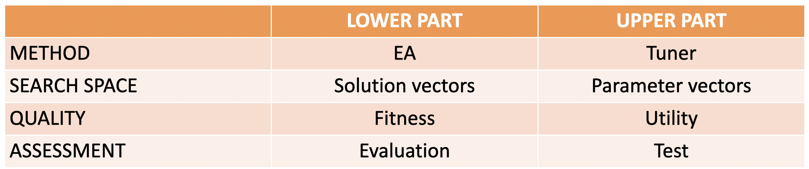
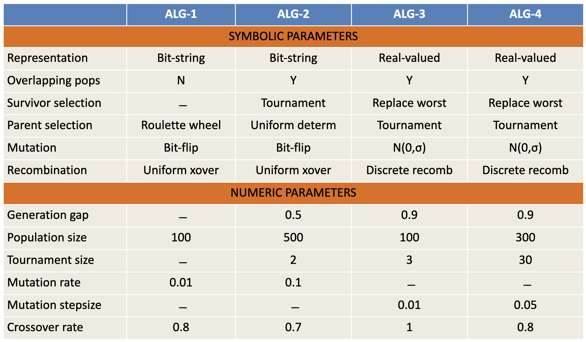

# Parameters and parameter tuning

The history of parameter tuning goes back many years. In 1986, a paper about meta-GA for parameter optimization was published, inherently starting a whole new chapter in GA research. The superset of everything related to these is called **parameter setting**, which is then divided into **parameter tuning** (happening before the run) and **parameter control** (happening during the run). The latter is further divided into subareas that depend on how it's done, **deterministic**, **adaptive** or **self-adaptive**.

### Parameter tuning

**Parameter tuning** happens when you're trying to find optimal values before the run. It has a certain number of problems: if the user makes mistakes, these could be source of errors, and it can cost a lot of time. The parameters interact with each other too, and good values **may become bad during a run**, as the optimal step size, for example, varies.

### Parameter control

This sets the values **during the run**, having different mechanisms, using predetermined schedules or maybe heuristic feedback from the search process. It could even be encoded in the chromosomes and wait for natural selection to optimize them. This process also has problems: finding the optimal $p$ is hard, finding $p(t)$ even harder. It's still user-defined, and natural selection may even not be helpful.

However, parameter control **offers a lot**: first of all, it allows us to change values during the run. Most important is that parameter control can *liberate* the user from tuning. The heuristic is less parameter-sensitive than the EA. 

So, how did this go in history? As already said, in the beginning it was vague. The work is somehow skewed, as there's quite some attention on crossover and mutation parameters, but there's not much work concerned with selection and population sizes. A few papers tried to do it all, and created a *parameterless* algorithm. Tuning practice is *invisible*: nobody knows how much effort was necessary for a given paper. 

The big picture, conceptually, connects different layers: we have an **application layer** containing a problem, then we have an **algorithm layer** that is optimizing the application layer (may be a Generic Algorithm), and finally we have the **design layer**, trying to optimize the algorithm. The designer could be a **user** or an **algorithm too** (meta-GA). 

There's also an information flow from bottom to top: the application layer is passing up quality information to the algorithm layer, while the algorithm layer is passing up information about the algorithm quality.

Looking at the diagram we can see a hierarchy: on the lower level we have an application which is parametrized by candidate solution variables, and these vectors together form the *space of possible solutions*. Every point is being evaluated for fitness. On the upper level, we see a similar algorithm: we have a design method that searches the space of parameter vectors, leading to an Evolutionary Algorithm having design variables, algorithm parameters, strategy parameters. All the parameters together form this space, and one point belongs to **one EA instance**, having a *fitness* which is stating the performance of the algorithm. This landscape is different, and unlikely to be easily searched. There's some structure that allows us to do better then *random search*. 

On the lower part, things are easy: we have a pre-defined fitness function, while the **utility** is much more difficult to calculate. It may be represented by the fitness, the time taken to reach it, some combination of these...

We have to distinguish between **online** and **offline** calibration, which is basically the difference between **parameter tuning** and **parameter control**. Both have their advantages. Tuning is easier, immediately needed (you can't start without it). It still has parameters, and on the long run, if we tune many parameters on many landscapes, we may learn something about them. There are some indications that suggest that good tuning is usually better than good control.

The basic insight here is that the **tuning problem is a search problem itself**. We can first use a **generate-and-test** approach, the easiest. The test happens running the EA, logging the performance in each run (looking at the quality or the speed). As the EA are stochastic, you have to repeat the algorithm multiple times. You may ask what's the minimum number of repetitions, heuristically set to 30. 

### Types of parameters

Looking at **numeric parameters**, you can see interesting things going on during the EA execution. The search space is searchable, and we can plot the range of parameter values and performance. These have a sensible distance metric.

On the other hand, **symbolic parameters** have **finite domain**, and there's no sensible distance metric, meaning that they are non-searchable. Sampling is our only option. Of course you can order these symbols and get some kind of search and plot. 

The number of parameters is not known in advance: a given value of a parameter could change the number of the others. For example, if you decide to have a **tournament selection**, then you get a numeric parameter being the tournament size. This means that parameters can have a hierarchical structure, and you cannot simply denote the tuning search space algorithm by the intersection of domains: $S=Q_{1} \times \ldots Q_{m} \times R_{1} \times \ldots \times R_{n}$.

## What is an EA?

You can construct tables listing all the **symbolic** and **numeric** parameters of an algorithm. Depending on the definition you give to things, it could be about EAs or EA instances.

Now, what is an EA **instance**? You have many definition options:

- There is only one EA, and 4 instances; 
- An EA is just a combination of the symbolic parameters. The numerics represent instances. This implies that the table contains 3 EAs with two instances
- An EA is a particular configuration of all parameters: EA and EA instance coincide. This means that the table contains 4 EAs/instances.

## Generate-and-test

The simplest approach to generate-and-test is just creating the initial parameter vectors, test them, and terminate. This is known as **non-iterative**. If you add a selection of parameter vectors, we're talking about **multi-stage**, while if you dinamically generate parameter vectors we're talking about **iterative** generate-and-test.

The computational effort is divided into several components: we have a number of *vectors tested*, the number of *tests you perform per vector* and finally the number of *fitness evaluation per test*.

The product of these may become pretty high. You can decide to optimize the first (*iterative search*), the second (*multi-stage search*), both the first and second (*combination*). You can even decide to optimize the last one, but that's not popular, neither done. 

### Optimizing the first

The methods that optimally use A are only applicable to numeric parameters: you have a number of tested vectors which is not fixed, and you initialize your parameter vector set with $N<<A$ vectors then iterate. This is done in Meta-EA, SPO, and REVAC. A tip for assignments, take a look at **Sequential Parameter Optimization.**

A method that was not taken further is **REVAC**: rather than just giving you a set of parameter vectors, it tries to give you insights about the landscape of their space. On the Y axis, you can see the iterations in the tuning method, and the Z method shows the **quality** of the parameter value. What you see is that when you begin tuning you don't know much, but as you gain more information you may discover good values. 

### Optimizing the second (reducing it)

These methods are applicable to both **symbolic and numeric** parameters, because you are not doing crossover to generate new vectors. You define a set of tested vectors, without extending it. To create a good set, you could do some grid search, random sampling or enumeration. You then try to test them on a low number of cases, and decrease the umber until you know enough. The basic idea is that you're testing them in a **breadth-first fashion**, meaning that you don't test any given vector a maximum amount of times, you just test vectors one at a time and iterate, then skip the ones having poor utility. The most famous implementation of this is called **Racing**.

### Optimizing them together

There's an algorithm called **Meta-EA with Racing**, but the best one right now is **REVAC with racing and sharpening=REVAC++**, which tests vectors $X<<B$ times, with $X$ dinamically increasing during the run of the tuner.

## Which tuning methods do we use?

We already know that there are differences between tuning algorithms: the maximum utility reached, the computational cost, the number of **their own** parameters (overhead costs), and the different insights they offer (some algorithm only give you a value, others tell you more about the landscape etc...)

There are similarities too: most of them can find good parameters, and nobody is really using them. 

The conclusion here is that **you have to tune your EAs**, and think of magic constnts (parameters hidden in the code). You have to decide between speed and quality, and between specialist and generalist EA.

## The future

Hybrid methods for A&B will be protagonist. Well funded EA performances are important. If we can make models of the utility landscape and not the fitness, we can collect knowledge. There will be open source toolboxes. As tuning is computationally terrible, a distributed execution will be interesting. Good testbeds are also very important.

Someone may ask what's better between GAs and EAs? A better question would be asking ourselves what a good representation would be, and which tuning it needs.

## Summary

- Pay attention at the difference between **parameter** and **parameter values**: crossover rate is a parameter, 0.5 a value
- Some parameters **matter more** than others
- You have to tune **the right parameters**
- Always make up your mind on whether you're tuning for **speed** or **quality**
- **Any tuner** is better than no tuner

