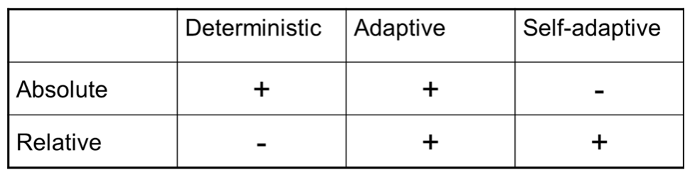
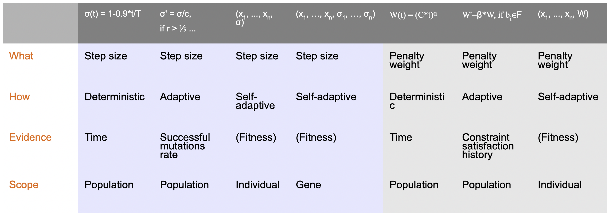

# Parameter control

First of all, **why**? The motivation for parameter tuning and control is the same: an EA has many parameters (strategy, hyperparameters...) for instance, the mutation operator and its rate, the crossover operator and its rate, the population size...

Good parameters are **important for good performance**. So, how do we find these? There is a big problem: if you keep the parameters fixed during a run, then you'll have a problem, as EA is adaptive and dynamic. This means that the optimal parameter may vary during a run. This insight led to the following: **parameter setting** can be divided into **parameter tuning** and **parameter control**, with the latter being the dynamic change of parameters during the run.

## Varying the mutation step size

We want to minimize the objective function that will make the fitness function over the variables (each having lower and upper bounds) optimal. We have inequality and equality constraints. We decide to use an EA with real-valued representation, because in the space of real valued vectors we can use mutation and crossover operators. We can use a **arithmetic averaging crossover** and **Gaussian mutation**.

### Option 1

So, what can we do to vary this mutation step size? The first idea is replacing the constant sigma with a function $\sigma(t)$ where $t$ is the generation counter, getting for example $\sigma(t)=1-0.9 \cdot \frac{t}{T}$.

In this way, the sigma will be independent from whatever happens during the search, we have full control over it and it is **fully predictable**, all individuals in the population will have the same sigma.

### Option 2

The alternative is making a system where the value of $\sigma$ depends on what's happening during the search. Every $n$ steps (fitness evaluations or generations) the $\sigma$ is updated, applying the 1/5 tule, where $p_s$ is the percentage of successful mutations:
$$
\sigma(t)= \begin{cases}\sigma(t-n) / c & \text { if } p_{s}>0.2 \\ \sigma(t-n) \cdot c & \text { if } p_{s}<0.2 \\ \sigma(t-n) & \text { otherwise }\end{cases}
$$
The properties of these mechanisms are that the sigma changes now basing on what's happening, the user has some control over sigma, sigma is not predictable anymore though, and it's acting on all the individuals of the population.

### Option 3

This alternative assigns a **personal** $\sigma$ to each individual, extending the representation to $n+1$ chromosomes. We apply variation, mutation and crossover to this variable too. In this way, sigma's changes are results of natural selection, there is no user control and $\sigma$ is not predictable. It will act on one single individual, for all attributes.

### Option 4

The last option is adding a personal $\sigma$ for each variable in the individual, which will require us to redefine variation operators. This mechanisms sees changes resulting from natural selection, almost no user control, no predictability and a $\sigma$ per variable.

## Varying penalties

Another interesting thing we can do is **varying the fitness/evaluation function**. A property of the problem we're solving is that it **has constraints** of two types: inequality and equality. 
$$
\begin{array}{ll}
g_{i}(x) \neq 0 & & \text { for } i=1, \ldots, q \\
h_{i}(x)=0 & & \text { for } i=q+1, \ldots, m
\end{array}
$$
For now, we'll just handle them in the same way, with **penalties**:
$$
\operatorname{eval}(x)=f(x)+W \cdot \operatorname{penalty} (x) \textrm{ with } \operatorname{penalty} (x)=\sum_{j=1}^{m} \begin{cases}1 & \text { for violated constraint } \\ 0 & \text { for satisfied constraint }\end{cases}$
$$
The main idea is **extending the fitness function** $f$ to an **evaluation function** being the sum of **the fitness and the penalty**. The fitness was supposed to be minimized, so now we have a maximum penalty being $m$ and a minimum being $0$.

### Option 1

If we do that, then we can change the evaluation function that's used by the selection in different ways. Similarly to the mutation step size, we can do the same with the **penalty weight**, changing it with $W(t)=(\mathrm{C} \times t)^{\alpha}$ where $t$ is still the current generation. We're looking for the same properties: changes being independent from the search, strong user control, W is fully predictable and it acts on the whole population.

### Option 2

Here, we can decide to change $W$ at a certain time $t$ with a formula similar to the 1/5, but we're now looking at champions (best individual of the generation). At a certain time, when we update $W$, we can check if the last $k$ champions are all feasible. If they're all feasible, we decrease the penalty, if they're all infeasible, we increase it, and we don't change it otherwise. For this method, the chagnes in W are based in feedback from the search, there's some user control, $W$ is not predictable anymore and it acts on the whole population. 

### Option 3

This is a very formal application of the idea used for the $\sigma$. Each individual is now keeping his own penalty weight, and variation operators are applied to it. The evaluation will now require the computation of the fitness of $x$ and the penalty of $x$ multiplied by the $W$ **carried by the same $x$**.

This means that we open up the possibility for **cheating**: evolution can easily find out that the **optimal solution has a value of $0$ on the last value**, meaning that the **penalty isn't counting at all**.

## Things we learned from these examples

We now know that strategies of parameter control can be distinguished by different features, the first being **what component is changed** and **how the change is made**. There are then secondary features regarding the **evidence/data** backing up changes, and the **level/scope** of the change. 

### Components that can change

In more details, when we look at the **components** that we can change, all the components of EA can be parameterized:

- Representation
- Evaluation functions
- Variation operators
- Selection operators
- Replacement operator
- Population

### How the change is made

If we look at the **how**, we can distinguish 3 major types of parameter control:

- **Deterministic** control, meaning there's a rule modifying the parameter without feedback from search, basing on some counter (tipically, time or computational effort)
- **Adaptive** control: has a feedback rule looking at the progress of the search, implying something on the change
- **Self-adaptive** control: we encode the value in the individual, and it undergoes evolution and natural selection

The how was used to make up the taxonomy, and the **what** is not part of the taxonomy but they can be combined, having combinations like *adaptive control of the mutation* or *self-adaptive control of the population size*. 

### Secondary features

The feature that concerns the **data/evidence** informing the change can also be classified into different types:

- **Time/number of evaluations** (deterministic control)
- **Population statistics** like the progress, the population diversity, the gene distribution
- **Relative fitness** value of the individuals created with given values

If you look at these, you get the same categories you got in the **How** section.

There's another classification regarding the data/evidence (favored by Smith) distinguishing between **absolute evidence** and **relative evidence**. The first, for example, might be *increase the mutation rate by 10% if the population diversity falls under some threshold $x$*. In this way, the direction and magnitude of the change is fixed. In **relative evidence** we compare values through **solutions created with them**, for example *increase the mutation rate by $x\%$ if the top $x\%$ came by high mutation rates, decrease otherwise*. In this way, direction and magnitude are dynamic. Both approaches have pros and cons, and some combinations make sense, others are impossible:

The last relevant feature is the **scope/level** of the parameter that is being controlled, and it can be very small like *sub-individual level*, or really generic like *the whole environment* (fitness function). 

It's important to note that the given parameter determines the possibilities: sub-individual change of the population size does not make sense!

## Summary

In this lesson we've seen multiple, interesting parameter control methods:

- Parameter control offers the possibility of using **appropriate values during different stages** of the search, offering **liberation from parameter tuning** (we're delegating the parameter setting to the evolutionary process)
- The algorithm will be doing two things: **solving the problem** and **calibrating itself**
- This creates an **overhead**