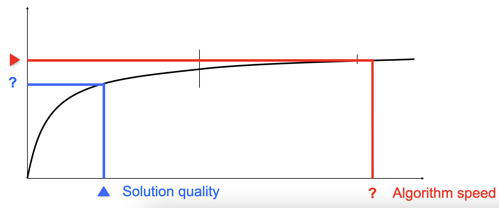

# Working with Evolutionary Algorithms

We'll now see how **experiment and algorithm design** are important, something about **test problems, measurements, statistics**.

Working on experiments, we always need a **goal**. The experimentation itself needs to **design an algorithm** and **run it**. When we're designing it, we're always combining it with specific **problems** that we need to solve, and **collect data** through measurements. You then need to write down what you find in a report/publication.

## Goals

What kind of **goals** can experimentation have?

- We may want to experiment to find a **good solution** for a problem
- Maybe we're interested in a **problem domain** and want to find out whether EA are applicable to it
- We could be more experienced, having designed our own EA and wanting to prove that it's better than others
- We may want to prove that EA are better than other algorithms
- We could be having an algorithm, and be looking for the best parameters
- We may want some insights on how an algorithm works
- We may want to see how an EA scales up with problem size, trying to use an algorithm on different problems having different sizes

If you want to apply an EA in practice, you can distinguish two kinds of applications: **repetitive problems** (you have the same problem, having **different instances**, for example an app for postage routes), and **the design problems**, being one-off, having *unique requirements and conditions*. An example of this may be building a road network.

It's very important to align goals and perspectives:

- **Design perspective** needs a very good solution, **once**;
- **Production perspective** needs good solutions, **every time**;
- **Publication perspective** has to meet scientific standards;
- **Application perspective** if you're working for a company, and good enough is good enough.

These are very often left implicit.

## Algorithm design

Arrived to this stage, you have to design **each and every component** of the EA. 

The first stage is the following:

- The first step is always the **representation**
- Then, we need a **mapping** between genotype and phenotype
- We have to specify **how to evaluate** an individual through a fitness function

We can then think about variation:

- We design suitable **mutation operators** that can work on the genotypes
- Then, we design **recombination operators**

Then we move on to **selection**, which is much more related to representation:

- We decide how to select the **individuals that will be parents**
- And how to select the individuals for the **next generation**

Finally, we need initialization and termination:

- Initialization method
- Termination condition

## Test problems

Now that you have an algorithm, you can apply it to **problems**: academics are always interested in **test problems** to try out the algorithm. The early approaches have seen a **collection of standard functions** invented by *DeJong* named the *5 DeJong functions*. The community later noted that it's too limited: there are now *25 "hard" objective functions* which are more interesting.

Real problems have a completely different way of creating test cases. A bit more academic approach is looking at **benchmark problems repositories**. You could even use problem instances made by random generators.

### Bad example

You could start by inventing some *tricky mutation* and want to prove it's good. You do that comparing your algorithm with a standard genetic algorithm, on 10 objective functions that you found in the literature. Your experiments reveal that your GA is better on 7 problems, equal on 1, and worse on 2. You write that down on a paper and submit it. There are a couple of problems though: you know nothing about the relevance of these results, you don't know much about the **scope** of your claims (you didn't classify the problems), you didn't look for a property distinguishing the problems in which your algorithm works good and works bad. Ultimately, you don't even know whether your results are generalizable. 

### Getting problem instances from real data

To test EAs, we could use **real data**: we have a problem from our company, and we need a real solution. This approach has the advantage that **the results are relevant** by definition. Someone finds that problem important!

Real data could also have disadvantages: it could be over-complicated, there may not be a lot of data, it may be commercially sensitive (difficult to publish and to compare), and results are usually hard to generalize.

### Getting problem instances from repositories

**Problem repositories** offer an alternative: you can find some of them concerning optimization, machine learning and so on... This has advantages, as the repositories mainly contain well-chosen problems and instances (people agree on these!), and there's a lot of work around them. These problems may not be real (missing some aspects), and even more importantly, **community algorithm may perform good just because they are tuned on the same problem**.

### Getting problem instances from problem instance generators

These are software that give you **problem instances for a certain problem**, for example the *Traveling Salesman Problem* generator or a *Graph generator*. The advantage of these is that they allow very systematic comparison, producing many instances with the same characteristics, and enable gradual traversal of these! For example, the TSP might be arbitrarily difficult.

They could also be shared for comparison. The disadvantages are that these problems are not real, and the generators might have a hidden bias, which may mean that it could give you an easy instance or not.

## Basic rules of experimentation

Experimentation **should be done with care**. There are basic rules to follow, as EA are stochastic:

- **Never draw conclusions from a single run**: you have to perform a sufficient number of independent runs, and you have to use statistics (for example, average or standard deviation) that tell you something about the overall behaviour. You also need **statistical tests** to assess the reliability of conclusions
- As EA experiments are very often about **comparison**, you have to be **fair**: use the same amount of resources for all competitors, try different computational limits, and work with the **same performance measures**

### Things to measure

The **metrics can be very different**: you may be interested in the average result in a **given time**, or the **average time** for a given result, the **proportion of runs** within a certain error margin of the target, the **best result** over $n$ runs, or the amount of computing required to reach a target in given time with % confidence.

Now, which **time units can we use**? This is important for the fairness of comparisons. Clock times are obviously not good, as they depend on the computational power, the network, the temperature...

You could look into the **CPU time**, but it depends on the power of the CPU and so on. The **number of generations** could be interesting, but if the population size varies it makes no sense.

The **number of evaluations** is interesting, but the evaluation time could depend on the algorithm (maybe the representation is complicated).

The **performance measures** (off-line, you run the algorithm and look into the data after the run) can be categorized into two groups:

- **Speed/Efficiency**: CPU time, number of steps...
- **Effectivity/Quality**: solution quality (fitness), success rate...

The **working measures** (online, look into what's happening during the run):

- **Population distribution** (information about the genotype)
- **Fitness distribution** (information about the phenotype)
- **Improvements per time unit** or per **genetic operator** like the mutations

### Performance measures

As mentioned before, hte **number of generated points in the search space** is an interesting measure (in EA, this is equal to the number of fitness evaluations). We can then talk about the **AES**, the Average number of Evaluations to Solution, one of the universal measures. We can even talk about the **SR**, Success Rate, measuring the % of runs that find a **solution** (being an individual with acceptable fitness) and the **MBF**, the Mean Best Fitness at terminatino, meaning that you take the best fitness and check the mean of this over the set of runs. 

Note that SR and MBF are different: there are different combinations possible. You can have an algorithm with low SR and high MBF, meaning that it always approaches a solution very closely, but it never gets that. This means that you have a good approximizer, and maybe giving more time to the EA would improve it. The other combination would be high SR and low MBF, you can have 70/80 cases with optimal solution while still having low MBF, so if it goes wrong, it does so a lot. This is known as a *Murphy algorithm*.

Graphically, these options can be shown as follows: we keep time on the horizontal axis and solution quality on the vertical.

The triangle means that we **fix that**, while the **?** means that we measure that. If we fix the solution quality, we have a run shown by the black curve and the speed will be measurable (we measure the location of the point in which the predefined quality was reached). 

We can even do the opposite, so we fix the maximum allowed time and then we measure the solution quality that the algorithm can deliver given this time. 

### Fair experiment

You have to **use the same computational limit for each competitor**, and the same number of evaluations. After this, there still may be hidden details, like **hidden labour** (if you have a heuristic mutation operator, it does a lot of smart things before actually deciding what to mutate) or **possibly fewer evaluations** by smart operators.

Comparing EA with heuristics is difficult: even though you may have the same number of steps, a step might be completely different across algorithm. You can solve this by looking at **scale-up comparisons**, meaning that even though the notion of an element is different, if you compare the steepness of the curve when you increase the problem size, you can compare the two algorithms efficiently.

There is no general solution for the comparison of curves: too many different situations can happen. If you take an average, this information will be lost. Plotting everything is also not a good idea, as it will be more difficult to spot things.

Using **statistics** is very important when dealing with **stochastic algorithms**, as different seeds can give different results. For example, claiming that a mutation is better than another has to be backed by statistical significance. The notion of **statistical significance** is grounded in the fact that even if you have just one random distribution, but you make two series of experiments (two sets of samples drawn from this distribution), they may have different averages and different standard deviations, which may make you conclude that one is higher/lower, not being true. 

When looking at different trials, you have to take a look at the **average**, but even at the **standard deviation**: if it's high, it may be a problem. You have to consider things like **T-tests** to indicate the chance that the values came from the same underlying distribution (meaning that difference is due to random effects).

One of the things that are important to realize is that **statistical tests may have conditions**: for instance, the T-test **assumes** that data are taken from conitnuous interval or close approximation, that the data are following a **normal distribution**, that they have similar variances for too few data points, and the groups of data points are similarly-sized.

If these conditions are not true, you may want to look at other tests, like **Wilcoxon**, which is preferred when numbers are small or the distribution is unknown, and **F-test**, which tests if two samples have different variances.

To learn more about these, check R Project and Octave.

One of the most used tools are **box plots**, which are intuitive: if they overlap, the differences are not significant. 

### A good example of experiment

Let's again say that you invented an EA, found 3 other EAs and a traditional heuristic for the same problem. You are asking yourself whether your algorithm is better. The way to do that is to find/make problem instances with a generator for that problem with two **parameters**: $n$ being the problem size, and $k$ being some problem specific indicator. You select 5 values for $k$ and 5 for $n$, obtaining 25 combinations. You generate 100 problem instances for each of these combinations, and execute your algorithm 100 times. The algorithm needs a high number of fitness evaluations too. This leads to a **lot** of fitness evaluations. 

You then record AES, SR and MBF.

The results are then arranged in a systematic way, making a 3D landscape where the plane is in 2D ($n$ and $k$) and the third dimension indicates the performance of the algorithm. You assess the statistical significance, and you finally found the niche for the EA: it may be *weak in some cases, good in others*, answering the **when** question. You then analyze the specific features, possibly understanding **why** your algorithm can/cannot do something. Like this, you learned a lot about the problem and its solvers. You achieved generalizable results, or at least the claims are well identified, as the scope. Ultimately, you contributed to the development of science as you published the code!

## Some tips

- **Be organized**: there are lots of details to take care of, so write them down
- Decide **what you want** and **how to measure it**
- Choose the **test problem** carefully: some problem instance may be better than another
- Make an **experiment plan**: there are so many versions to compare, this takes time which you'll want to estimate!
- Perform a **sufficient number of runs**
- Keep all the **experimental data**: storage is cheap, store anything!
- Use good statistics and standard tools (don't reinvent the wheel!)
- Present your results **well**
- Watch the **scope** of your claims: never say your EA is better than another without specifying why and when
- Make this scope big, aiming at **generalizable results**
- Publish your code and data so that people can compare and validate

## Summary

- Algorithm testing must be based on **many problems** and **many runs**
- A good **test suite** and **good statistics** are crucial
- There are different performance measures, regarding the **algorithm speed**, the **solution quality** or the **robustness**
- The priorities that we follow can depend on the **purpose**, the **design**, the **type of application** (one-off vs. repetitive) and the **budget** too (computational and financial)
- **Scope** your findings, aiming at generalizable findings
- **Fully specify** your algorithm, including values
- If possible, go for **open source** and **open science**.