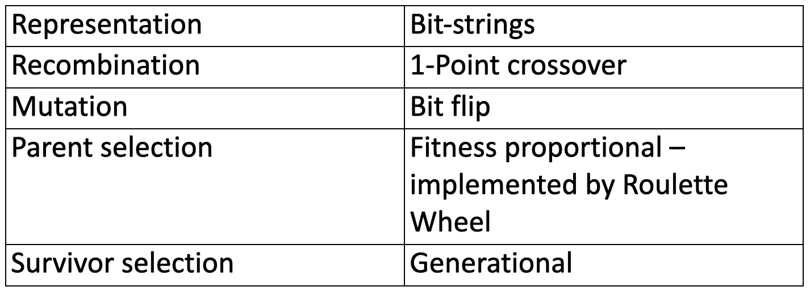
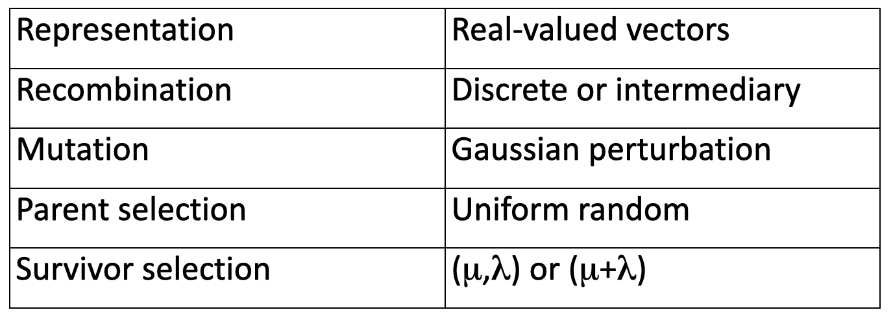
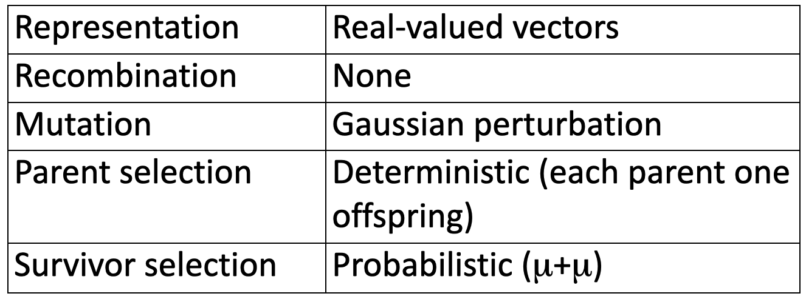
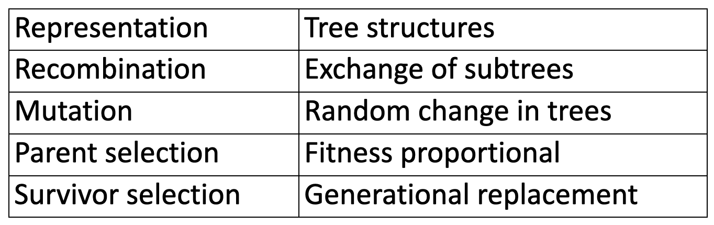
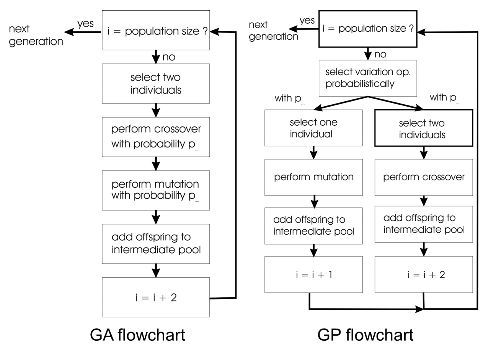

# Popular EA variants

This chapter is divided in two parts: first, we'll talk about the traditional EAs (in the first edition of the book, the chapters were differently divided, as it was very important to list the algorithms' categories, as GA, EA, EP, GP...). In the second part we'll talk about more recent versions.

## Traditional variants

In the first edition of the book, we've only seen talked about the traditional variants:

- Genetic Algorithms **GA**
- Evolution Strategies **ES**
- Evolutionary Programming **EP**
- Genetic Programming **GP**

### Genetic Algorithms

These were developed in the USA in the 1960s by guys who are still around. GAs are typically applied to discrete function optimization, benchmarking, and binary representation using b-strings. This means that there's a whole class of binary problems to which is easy to apply them.

They are **not too fast**, they **miss new variants** (the traditional versions at least) and they are often used for _mathematical analysis_.

The original version from the PhD is now known as the _Simple Generic Algorithm_.

The **Evolutionary Algorithm Tableau** gives us information about these algorithms:

Generational survival selection means that only the children survive.

Given a population of `n` individuals, you select `n` for the mating pool.

You then shuffle the mating pool, and apply crossover for each consecutive pair with probability $p_c$, then apply mutation with probability $p_m$. You will now have $n$ individuals with which you replace the entire population.

If, for example, we wanted to maximize the function $x^2$ over $\{0..31\}$, we would represent these numbers as binary code. Then, we evaluate the fitness of the initialized population, mate and mutate. In every new generation, we can notice that the average fitness is going higher.

This algorithm has been subject to lots of studies, but it has many shortcomings: for example, using bit-strings is far too restrictive, the mutation&crossover operators are also limited to that, the selection is sensitive to _premature convergence_ and the generational population model could really be improved.

**Genetic Algorithms** are good for _combinatorial optimization and constraint satisfaction_, there are **lots of variants** (so, lots of design choices), they have a **large academic fan-base** (still used and developed), but for _outsiders_, the name GA is kind of abused.

### Evolution strategies

These are also very **popular** right now, and they have roots in Berlin in the 1960s. This has a quite clear niche now: numerical optimization projects. These are **fast**, very **good solvers**, and they have quite some mathematical analysis on their workings. A special **feature** of these is **self-adaptation of mutation parameters**.

The tableau is the following:

As for the mutation operator, the lecture on **parameter control** introduced this example to change the mutation step-size based on how the algorithm is doing. This version is based on the **one fifth rule**, keeping track of the number of successful mutations, and after $k$ iterations it checks whether this percentage is higher/lower/equal to 1/5, and adjusts the mutation step-size accordingly.

Speaking of mutation, it's useful to remember how a Gaussian distribution looks like. Changing $\sigma$ highly changes the shape of the distribution. Increasing it smooths the curve.

The classic experiment that is shown to prove the goodness of ES is the **jet nozzle experiment**: the task was optimizing a jet nozzle (maximize the thrust), and they obtained a pretty strange shape which is pretty performing too. The conclusion is that evolution can solve a problem in a very unexpected way.

The **genotypes** are equal to the **phenotypes**, except that the chromosomes are **extended** because of the self-adaptation. **Recombination** always creates **one child**, not two as in GA. The operators can be _averaging_ or _selecting_ on each single variable of the genome. You could even choose a random one for each chromosome. We could implement a multi-parent recombination, with a random number of parents, in which two parents are **selected randomly for each chromosome of the children's genome**.

**Parent selection** is uniform random: all parents have the same probability to be selected. This means that we'll need a _push towards quality_ in the survival selection.

**Self-adaptation** is already known, and it's especially interesting when we're working with a **dynamically changing fitness landscape** (the objective is continuously changing).

For this you need to have a population size bigger than 1 to carry different strategies, $\lambda>\mu$ to generate a surplus offspring, and the _comma strategy_ is better to get rid of wrongly adapted $\sigma$s.

A famous experiment, the _cherry brandy experiment_, proved that to find a colour mix yielding a target colour, these algorithms work good. The representation was just $w,r,y,b$ with no self-adaptation, and they used a $(1,8)$ strategy: you create 8 new color mixes, you present them to a human observer, and he chooses. The fitness was therefore subjective to the human eye. In just 20 generations, this method was able to deliver a good color. This is surprisingly interesting for a reason: we can use this method **without a quantifiable fitness value**!

This method was used to optimize the _Ackley function_ too.

So, **ES** are very good for **numerical optimization**, they can work with low computational budgets (as they have low maximum of fitness evaluations) and therefore **high dimensional problems** (large number of variables). Self-adaptation is **standard in ES** (it may be called the distinguishing property), and the algorithms have fewer parameters and design choices. There are many applications in business and industry, and a well-known implementation is CMA-ES.

### Evolutionary Programming

**EP** was developed in the USA in the 1960s (still pretty old). These are typically applied to traditional tasks (finite state machine prediction) or contemporary ones (numerical optimization). These are a **very open framework**, there are no restrictions on the representation as long as it fits the problem. Its identity is therefore less clear.

A very special feature is that there is **no recombination**, and they use **self-adaptation of parameters**.

The origins go back indeed to the 70s, in a developing time for AI. One of the perspectives of that time was that intelligence should very much be able to **predict**. This made these research trying to build good predictors. Finite State Machines can be used for that: they have a finite number of states, in which every one of these can receive inputs and give outputs. A transition function links a state and an input to a state and an output. You could also see such a system as a simple input-to-output device. The transition function is represented by diagrams, in which the circles represent a state and the edges represent the transitions.

We could try to use these systems to predict things, for example _prime numbers_: the system is given numbers, and it has to output whether it's a prime or not. The fitness function is simple: each correct prediction is worth 1, a wrong one is 0. This application had a penalty for _too many states_ too.

The algorithm therefore tries to create a FSM that is able to do so.

_Too many states_ can happen because the mutation operator can resize these systems. The parent selection is that every FSM is mutated once (each parent gets one child), and the mutation operators are 5 to be used, each used with the same probability. They can change an output symbol, change a state transition, add, delete or change a state. Running the system delivered an interesting result: they got a very simple FSM that **always predicted False**. Now we know that this is an _opportunistic predictor_: as there are not many prime numbers, it will still have good accuracy.

Modern Evolutionary Programming is different: the representation can be anything, and mutation can be anything too. It also applies self-adaptation. This makes a system quite recognizable: the object variables form the first half of the genotype, and the second half contains the **mutation step-sizes**, as every variable has its step size. The difference for these step-sizes is obtained as follows:

$$
\begin{aligned}
&\sigma_{i}^{\prime}=\sigma_{i} \cdot(1+\alpha \cdot N(0,1)) \\
&x_{i}^{\prime}=x_{i}+\sigma_{i}^{\prime} \cdot N_{i}(0,1)
\end{aligned}
$$

Comparing this to the old one, we notice that priorly we used an $exp$!

It's always used with a **boundary rule**: if sigma is too small, we make it bigger again.

As before, we cannot mutate $\sigma$ after the normal mutation, as this would influence the fitness evaluation!

Some other distributions for the random noise were used, for example _Cauchy_.

**Recombination** is the most interesting operator as **it is absent!** The idea is that they are working on one point in the search space, considering it as a **species**: these cannot mate with each other!

This fueled a lot of debate about mutation vs. crossover, ultimately reaching the conclusion that crossover should be used.

**Parent selection is easy**: no bias towards quality and no stochastic choice. Deterministically, each individual creates one child by mutation.

A very impressive application was published by _Fogel_ for **game playing**. He went to conferences, made people play with his game, and trained a neural network basing on these games. Additionally to these variables, he has self-adaptation with the same number of parameters. Ultimately, he evolved this for 840 generations (6 months) and reached ultra-high scores.

**EP** has a less clear identity, and modern versions are hard to distinguish from ES. This branch is, probably for this reason, becoming **less active**.

### Genetic Programming

The last member is **GP**, the **youngest brother**. It had origin in the 1990s in the USA. GP are usually used for **machine learning tasks** rather than optimization and design. This means that it competes with NN and other ML algorithms. It needs **huge populations** and therefore **it's slow**.

Special features are that it uses **non-linear chromosomes** (tree, graphs...), and **mutation is possible but not necessary**. Given this, it's completely the opposite of EP.

The tableau is the following:

This is basically a Genetic Algorithm with a different representation. The example is a **bank that wants to predict loan paybacks**. We have data that can be used for this, and we want a condition in a style of _if-then_. In GA we always use crossover and mutation, while in GP we choose **either mutation or crossover**. If we need to have reproduction, we select two individuals, while if we want to mutate we choose one. We choose the variation operator **probabilistically**. We first decide the operator, then select.

As the populations are rather large, parent selection is usually fitness proportionate. GP typically divides the population in 2 groups, the best $n$ individuals and the others. 80% of the selection operators will choose from the top group, while 20% from the other one. There are some _magic numbers_ that can be chosen. **Survival selection** is generational, meaning that basically there's none.

Initialization is **very specific**: the data structure is specific too. We have to create a number of trees, having a maximum depth. We then have two options: filling the tree entirely till the maximum depth but avoiding the function symbols (then, initialization is nothing else then selecting function symbols and terminals), or a **grow method** which starts with a root node (knowing how many attributes we need) and select the nodes iteratively. In this, you could get a terminal symbol instead of a function one: this means you can forget the subtree and make it a terminal. Note that function symbols are put in branches (nodes having children), while terminal symbols are put into _orphans_. Usually we use these together, filling half of the tree fully and the other one with the grow method.

Mutation can **increase the tree size**: if the data structures can grow, they **will**. This is known as **bloat effect**, or _survival of the fattest_. There are some ways of preventing this: if mutation/crossover creates a fat kid, we kill it, or alternatively we can introduce a penalty in the fitness.

A good example for this is _symbolic regression_. We have $n$ data points, and want a function that fits them. The phenotype is a _formula_, consisting in mathematical operations (+,-,/,\*,sin,cos...)

Based on this you can have trees, and define the quality as the error of the formula. You fill in the x values into this function, obtaining the **guess**, you compare it to the real value and get the error.

**GP**s are an evolutionary approach to modeling/machine learning, and they work good for behavioural strategies and policies. The results are readable (unlike NN), but they **can be very big**. GP requires large populations and many generations, hence much time and powerful computing. It had a very good _marketing_, as very well documented and impressive achievements.
