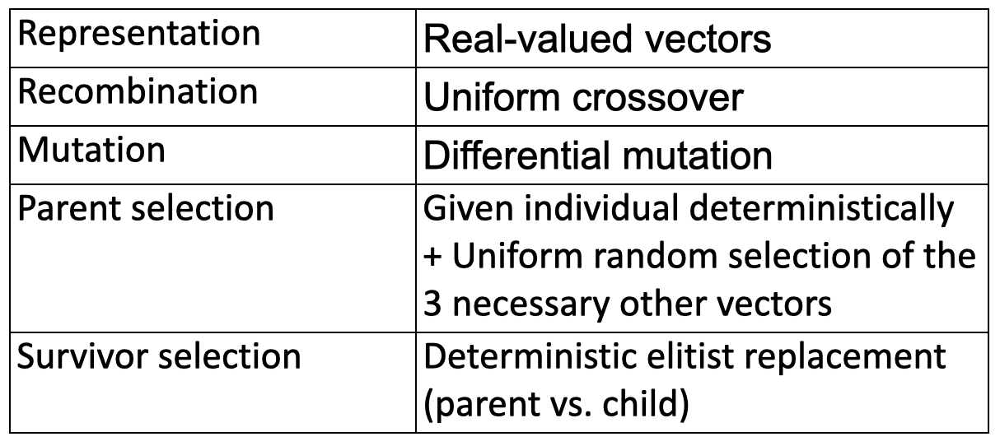
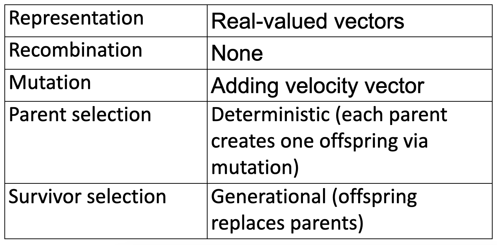
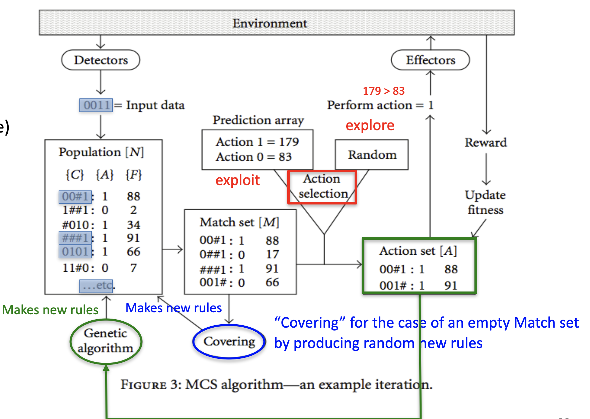
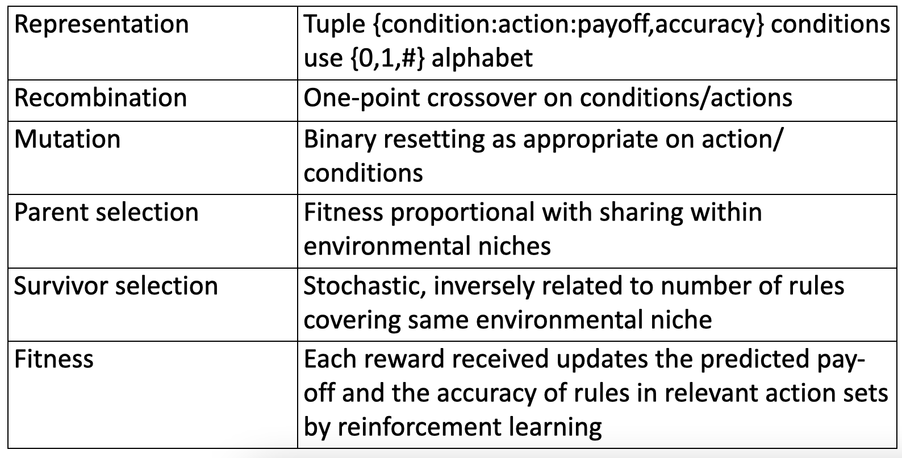

# Newer EA variants

In the first part, we've seen older approaches. We can now see some later approaches to similar problems.

## Differential Evolution

This was developed in the USA in 1995, and it's typically applied to nonlinear and non-differentiable real-valued functions. Populations are **lists**: not simply sets (they do have a **position!**). Interestingly, they need **4 parents** for a new individual, and there are different variants having different hyperparameters.

The **differential mutation** is the crucial part, giving its name to this method. What's this? Given a population of candidate solutions (list, in this case), for each of these you create an offspring vector. You then create a mutant vector by adding a perturbation vector calculated as the difference between two other population members: to perturb $v$ you select two random individuals from the population, you calculate the difference multiplied by some scaling factor and add that to $v$.

$$
\begin{aligned}
&\bar{v}^{\prime}=\bar{v}+\bar{p} \\
&\bar{p}=F \cdot(\bar{y}-\bar{z})
\end{aligned}
$$

Crossover is simple: it's **uniform** (as we know it) with a crossover probability **per position**. Formerly, the probability was _per individual_. There's a special restriction: at one position (randomly chosen), the child allele is always taken from the first parent without making a random decision. This avoids a full duplication of the second parent. The **evolutionary cycle** proceeds as follows: you have a population $P$, having a random ordering (not related to fitness). First, we create a **mutant vector population**, where each mutant vector is composed by randomly drawing 3 random vectors, where $a$ is the basis and $b,c$ are used to create a difference vector. We use this difference vector (multiplied by a scaling factor) to mutate $a$: $v_{i}=a_{i}+F \times\left(b_{i}-c_{i}\right)$.

In the next step, we create a **trial vector population** using the MVP. Each individual $\bar{u_i}$ is made by **uniform crossover** between $ \bar{x}_{i}$ and $\bar{v}_{i}$.

Finally, a deterministic selection is applied to each pair $ \bar{x}_{i}$ and $\bar{u}_{i}$, picking the best of these two for the offspring.

Remember that individuals here are just vectors $<x_1,x_2,x_3,...>$.

What we do, for example, is following:

- We have 6 individuals
- To create the **mutant vector population**, we:
  - Choose three random individual $a$,$b$ and $c$
  - Subtract the values of $b$ and $c$ to get the vector $b-c$
  - Sum the individual $a$ to $F(b-c)$ obtaining $v_1$
  - Repeat for each $v_i$
- Then, we **create the trial vector population** by crossover between the original and the mutant:
  - We select $x_1$ and the mutant vector we just created $v_1$
  - We uniformly cross-over these two, obtaining $u_1$
  - We select the best among $x_1$ and $u_1$

We have **different variants** of this algorithm, denoted by $a,b,c$:

- $a$ denotes the way we choose the **base vector**, as it could be a random one or the best
- $b$ is the number of difference vectors we use to define the perturbation, in the example we had $b=1$ but with $b=2$ we'd have $\bar{p}=F \cdot\left(\bar{y}-\bar{z}+\bar{y}^{\prime}-\bar{z}^{\prime}\right)$
- $c$ denotes the crossover scheme (_bin_ is uniform crossover)

## Particle Swarm Optimization

This was developed in 1995, and it's used for **optimization of non-linear functions**. It's interesting as it **lacks crossover**, and every candidate solution **carries its own perturbation vector**.

This is not inspired by evolution, but by the social behaviour of birds/insects/fish: elementary units are seen as particles having **location** and **velocity**.

A population member is a pair $\langle\bar{x}, \bar{p}\rangle$ where $\bar{x}$ is a solution vector, while $\bar{p}$ is a perturbation vector. The latter determines how the solution vector is changed to produce a new one: $\bar{x}^{\prime}=\bar{x}+\bar{p}^{\prime}$. Note that $\bar{p}\prime$ is not $\bar{p}$: it's calculated with it and some additional info.

Note the similarity between ES, EP and PSO: we first create a new $p\prime$ then use it to create a new $x\prime$.

The metaphor is now spatial: we compute a new velocity vector as the weighted sum of 3 components. It's obtained by the current velocity vector, the vector from the current position to the best past position of **this particle**, and the vector from the current position to the **best past position of the population**.

$$
\bar{v}^{\prime}=\text { weight } 1 \cdot \bar{v}+\text { weight } 2 \cdot(\bar{y}-\bar{x})+\text { weight } 3 \cdot(\bar{z}-\bar{x})
$$

Note that the personal best must be remembered, and the notion of particle has to be extended.

Therefore, a particle contains 3 vectors:

- a **position vector** $\bar{x}_i$
- a **velocity vector** $\bar{v}_i$
- a **best position vector** $\bar{b}_i$

In **mutation**, each triple is replaced:

$$
\begin{aligned}
&\bar{x}_{i}^{\prime}=\bar{x}+\bar{v}_{i}^{\prime} \\
&\bar{v}_{i}^{\prime}=w \cdot \bar{v}_{i}+\phi_{1} U_{1} \cdot\left(\bar{b}_{i}-\bar{x}_{i}\right)+\phi_{2} U_{2} \cdot\left(\bar{c}-\bar{x}_{i}\right) \\
&\bar{b}_{i}^{\prime}=\left\{\begin{array}{cc}
\bar{x}_{i}^{\prime} \quad \text { if } f\left(\bar{x}_{i}^{\prime}\right)<f\left(\bar{b}_{i}\right) \\
\bar{b}_{i} & \text { otherwise }
\end{array}\right.
\end{aligned}
$$

Note that $w$ and $\phi_{i}$ are the weights, and $U_1,U_2$ are randomized matrices. Finally, $\bar{c}$ denotes the population's best.

We can recognize components: **social** and **individual behaviour**. The central element is _personal history_, while the last one is _social_.

The value of $w$ can control exploration and exploitation: we'd like the particles to _decelerate_.

## Estimation of Distribution Algorithms

These try to fix a problem all EAs have: they can give you a good solution, but no insight on the problem. They usually cannot know anything more, for example, the fitness landscape.

A good approach to this is using **model-based EAs** which sample the fitness landscape, and try to fit a distribution and use this to generate new individuals.

Basically, what happens is that we create a random population, we **compute the fitness**, select the best individuals and try to fit a Gaussian distribution onto these. We then sample a new population from distribution and loop.

## Model assisted EAs

These are becoming more and more popular. If you think about it, EDAs build and use a model in the reproduction step. We could do the same for the **fitness evaluation step**: this is rather smart, as fitness evaluation is usually time-consuming. Sampling from a model is usually way faster, and the model building overhead could pay off. The idea is adding a model, and only x% of the fitness evaluations is real, while the majority of them is done using the model.

## LCS: Michigan-style classifiers

This is not completely new, but it's not very popular even though it's good. These are overly complicated and not so available online. John Holland wanted to use this search algorithms for machine learning tasks.

This is a combination of a classifier having rules, and a learning algorithm giving you new rules. The rules do not necessarily compete, rather **cooperate**. The GA produces new rules, and there are two _schools_: the **Michigan-style** and the **Pittsburg-style**. The first sees _rules as individuals_, while the latter sees _rule sets as individuals_.

The representation is based on rules: a _condition_, an _action_ and a _payoff_ (fitness value). A match set is a subset of rules **which matches the current situation**. The **action set** is the set of actions that are contained in the **match set**.

In later versions, the representation was extended by a 4th component stating the **certainty** of the payoff.

There is an environment, which could be anything, providing some situations to which the algorithm has to respond. Let's say the input could be described by 4 digits. Then, we look at the current population consisting of rules, having 0,1,and # (wildcards=don't care, always triggered). We can see in the population that 3 rules match the conditions. These rules form the **match set**. If we are in exploitation, we choose the action with the highest support, producing an environment reward which is fed back to the system. The feedback is distributed over those rules that voted for the action, increasing their fitness values. In order to do something when **no rules match**, we create random rules.

## Summary

There are several _dialects_ or variations of the EA family. Some of them are classic, some of them are more innovative. Some are newer like PSO or EDA. Others have a primary application area, for instance GA are used in discrete Combinatorial Optimization, ES are applied to continuous optimization, while GP is used with ML and modeling. Importantly and interestingly, methods can be shared by them. Some techniques like PSO do not use evolutionary metaphors, but the generic EA template is followed.

Speaking of metaphors, there are a lot of new methods which are still equivalent to old things. Finally, the specific type of an EA is not important for applications: you just have to think about whether it can solve your problem.

Metaphors have been very useful in the development of new algorithms, but in many cases (for several papers) a new method is just old ideas repacked with new ones. They just change the naming, and this discredits the whole idea of metaheuristics inspired by nature.

There is a paper about this, _Metaheuristics - the Metaphor exposed_.
