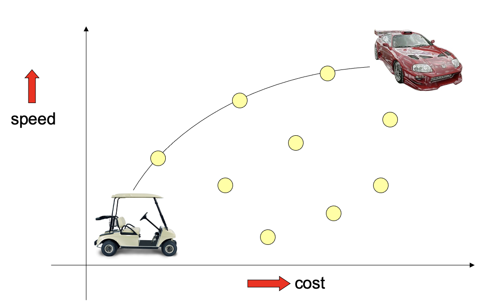

# Multiobjective evolutionary algorithms

First, let's have a little insight about multiobjective optimization problems, including **Pareto optimality**.

Then, we'll see the EC approaches.

## MOP

Multiobjective problems form a wide range of problems defined by the presence of **more objectives than 1**, possibly conflicting. 

We therefore may have 2 types of problems problems: finding a set of good solutions, and selecting the best solution for a particular application.

Considering a *car buying problem*, we have a couple of points designating a certain car. 

We want to optimize both cost and speed. We consider two spaces: the **decision space** and the **objective space**. The first is concerned with **details we can control**, for example horsepower and materials, while the second is composed by **criteria by which we choose**, for example speed and cost. For example, heavier materials imply lower speed. 

While we are in the objective space (having 2 objectives in the example) we can use a 2D system formed by the two objectives. We can assume that our optimization means minimizing both. We can observe that in some cases, the two objectives collide! $a$ and $d$ are not comparable, as the first wins on $f_1$ and the second on $f_2$.

Based on this observation, we have a specific way of comparing solutions, basing on the **dominance relation**: we say that a solution $x$ dominates solution $y$ if it's better in at least one objective, and it is not worse than $y$ in all the others.

So, having this dominance relation to sort our points in space, we can identify two interesting sets for a given solution $x$: **the set which dominates $x$**, and the set which is **dominated by $x$**.

### Pareto optimality

This is defined on the **dominance relationship**: a solution $x$ is **non-dominated** in a set of solutions $Q$ if **no solution from $Q$** dominates $x$.

The **pareto-optimal set** is the set of non-dominated solutions **in the solution space**.

The **pareto-optimal front** is instead the **image of the pareto-optimal set** in the **objective space**.

In general, we want to have a set of **non-dominated solutions**, being as close as possible to the **pareto-optimal front**, while maintaining **diversity**: we don't want a particular segment, rather cover the whole front and choose the whole set. 

The big difference here is that while single-objective optimization returns **one solution**, multi-objective returns a **pareto-optimal set**. The goals is no more **convergence only**: diversity is another goal now!

## Evolutionary computing solutions

We have two possible solutions, **preference-based** or **real multiobjective**.

### Preference-based (aggregation-based)

In this, we transform the problem into a **single-objective problem**, using higher level information that implies preference on the importance of objectives. A simple example is a **weighted sum**, requiring that the weights sum up to $1$.

Every given pair of weights defines an angle, which defines a line. Shifting the obtained hyperplane is how we can identify the pareto front, and shifting the angle changes the point of the pareto front we return.

### Real multi-objective

Now we obtain a set, and later choose among these solutions. The criteria may even not be quantified in advance, and may not be quantifiable at all! As EAs are population based, they are inherently built to return a set of trade-off solutions! This works for both the aforementioned approaches. We don't have to adjust the EA, meaning we can simultaneously search for a set of points approximating the pareto front. 

There are some requirements:

- You need a **fitness function**, tipically based on dominance
- You need a **method to maintain diversity**, as we need a whole set of solutions
- You need a **method to remember all good points** seen during the search

As for the fitness assignment, we have the *cheating approach*, which may not guarantee a good result. We can segment the population and use objectives separately in these populations, but there are no strong guarantees. Tipically we use the dominance approach to rank the population, but *fitness will be related to the whole population*.

The diversity maintenance is *not that hard*: all the already seen methods work, for example fitness sharing, a penalty, and the separation of search space in boxes (counting occupancy).

It's important to know that all of these diversity tools rely on a *distance metric*.

The *archive* to remember all good solutions could just **be the population**: you can simply solve the problem using elitism, meaning that best individuals **always survive**. It's even possible to introduce a *Hall of Fame*, making sure that good individuals are not forgot.

 