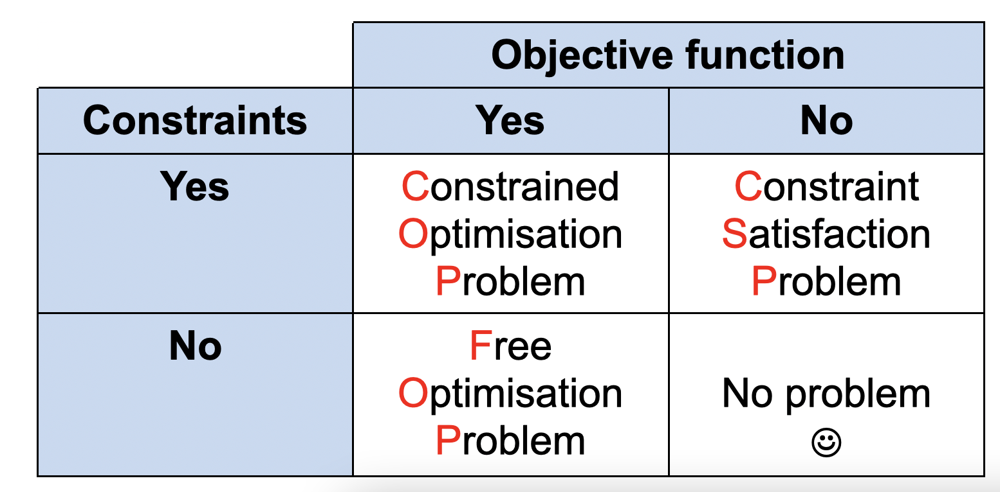
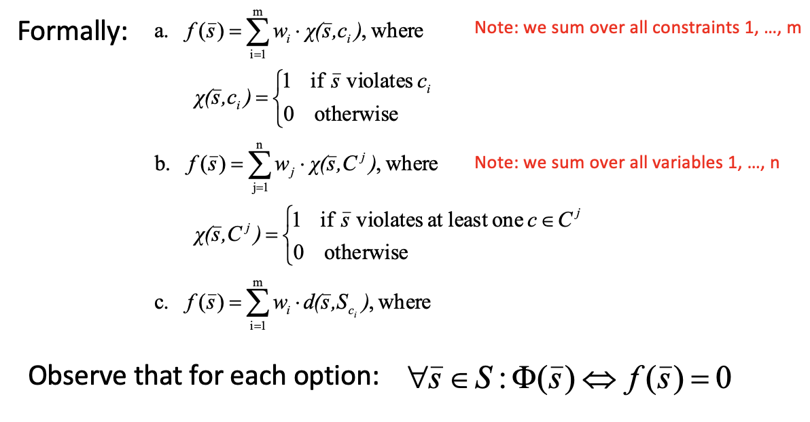

# P - Constraint handling

Constraints are everywhere, cause troubles and we need to do something about it.

## Motivation

Why should we bother? First, a great deal of practical problems are constrained. In theory, a great deal of interesting NP-hard problems are *constrained*. 

EAs show a good ratio of implementation effort/performance, and they are acknowledged to be good solvers for tough problems. 

A **constrained problem** might for example be the *Travelling Salesman Problem*: we could say that the set of city names $C$ can be used to define a search space, as a cartesian product. That means that if the search space is $C^n$, an element of the space is a set of $n$ cities. We know that the search space is the permutation of the elements of $C$. These two approaches are definitely different: taking $C^n$ we have all possible combinations of city names, even those having repetitions of a city. We need a **condition that limits those possibilities** excluding them. This proves that the **notion of a constraint problem** depends on what we take as a search space: in the permutation case, we have no constraints. 

Even if we take the *permutation option*, we still cannot do an uncostrained *free search*: this depends on what we consider *standard mutation* and *standard crossover*. These have to guarantee that elements of the mutant are **also in the same domain**. Now we can define a **free search space**, being the product of the domains. The good news is that membership on the search space is coordinate-wise: given a vector, you can check it variable-by-variable. Therefore, a free search space allows free search.

Generally, a **problem can be defined** through an **objective function** and **constraints**.

In chapter 1 we've seen 3 possible solver schemes:

- the optimization-modeling-simulation scheme
- the FOP-COP-CSP scheme
- the NP scheme

The second one is required in this lecture: it acknowledge that objective function and constraints are two different properties of a problem.

Let's look into the different kind of problems.

### Free optimization problem

This is given by a **free search space**, and a **real-valued objective function**.

A solution is a solution $s \in S$ such that $f(s)$ is optimal.

EAs have an instinct for optimization: we can simply pose $f(s)$ as fitness function.

An example might be any numerical function, like the *Ackley function*.

### Constraint Satisfaction Problems

We now define the problem with an **existing space $S$**, a non-existing objective formula, and a **boolean function (feasibility condition) on $S$** $\Phi$ telling us whether the constraints are satisfacted, i.e. the solution is feasible. 

When you look into this feasibility condition, it's almost always defined using *small constraints* having a couple of variables. It is known from theory that generally CSPs are NP complete. There are theoretical results saying that all CSPs are equivalent to a binary CSP, where all $n_i = 2$.

### Constraint optimization problem

These have a free search space $S$, a real-valued objective function $f$, and a feasibility condition $\Phi$. The result is a solution $s \in S_{\Phi}$ such that $f(s)$ is optimal in $S_{\Phi}$.

A good example of COP is the TSP, having the condition that no city name occurs twice, yet having to optimize the traveled distance.

## Evolutionary computing

When you want to solve CSPs by EAs, you notice that CSPs have no function to optimize. It must therefore be transformed to a problem having one. There are two options for this: we transform it into an FOP, having $\langle\mathrm{S}, \bullet, \Phi\rangle \rightarrow\langle\mathrm{S}, \mathrm{f}, \bullet\rangle$ or alternatively transforming it into a COP, obtaining $\langle\mathrm{S}, \bullet, \Phi\rangle \rightarrow\langle\mathrm{S}, \mathrm{f}, \Psi\rangle$ having some constraints which become objectives, some not. 

These must ensure that if we have a solution of the new problem, it also is a solution of the original problem.

To handle constraints there are two options:

- **Indirect constraint handling** (cheating): we trasnform the constraint into an objective, before running the EA
- **Direct constraint handling**: you take care of the constraint during the run

If you do CSP$\rightarrow$FOP all the constraints are handled indirectly, while with CSP$\rightarrow$COP some constraints are handled directly, some not.

### Indirect constraint handling

This is always needed, as you always have to transform some constraints into objectives. The easiest possibility is a penalty for violated constraints. An alternative might be a penalty only for the **wrongly instantiated variables**. A final, smarter way is **estimating a distance/cost** towards a feasible solution and minimize it.

How this all works requires a little bit of notation: let's say we have $m$ constraints and $n$ variables $v_j$. For every variable $v_j$, we can define the set of all constraints that involve it $C^j$.

Considering all the aforementioned options, we obtain the following:

If $f$ has value $0$, all constraints are satisfied.

#### Pros and cons

A first advantage is that this method is **simple** and **problem independent**. When we're solving a problem, we can use a random EA or any optimizer. If you have these weighted sums you have the opportunity to express priorities among constraints. Finally, the EA is allowed to **tune fitness function** by modifying the weights during the search.

Downsides are that lots of information are loss by packing everything in a single number, and this method was not proven to work well in sparse problems.

### Direct constraint handling

The other option is **direct constraint handling**, and it typically problem dependent. The only problem independent solution is just **eliminating infeasible solutions** when found. This is extremely inefficient. A better way might be repairing infeasible candidates, though being problem specific and possibly difficult. Special mutation/crossover operators could be introduced to preserve feasability (requiring feasible initial population), which is somewhat what happens with a permutation representation. 

The final solution is **decoding**, transforming the search space into **another one** in which values can exist wherever they want.

#### Pros and cons

This **works better**, but it's **problem specific** and therefore there are no **generic guidelines**.