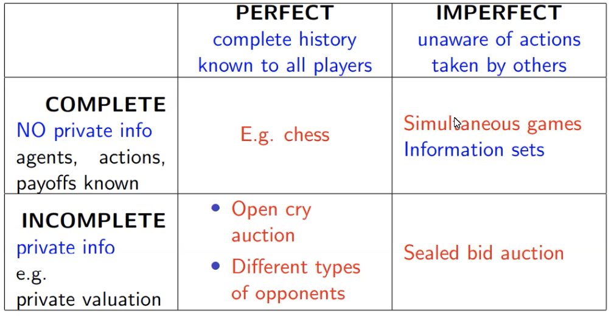
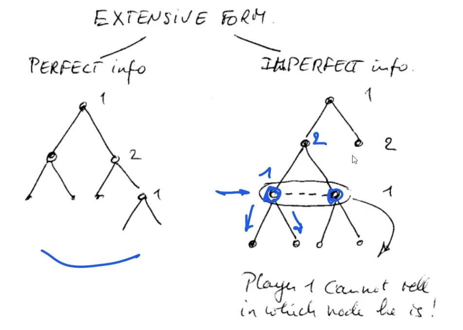
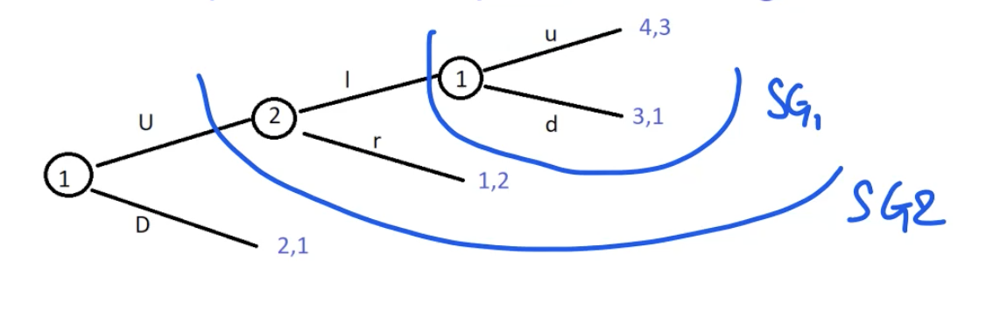

# Sequential games

In normal form games you have simultaneous moves of players, or at least the players do not known what the opponents have chosen. Now, we're looking at games in which the players know what the opponent has done, repeating this for a number of times. At the end, a payoff is collected. There are different ways in which information can be shared: there can be **perfect information** (the players have full knowledge of preceding moves) or **imperfect** (players are partially knowing the game history).

We first of all look at the case of perfect information, as in the game of chess. There are lots of examples, like open cry auctions, stackelberg's duopoly model, **negotiation** (Rubinstein's model).

The thing about sequential games is that you can actually represent them using a **game tree**, a graphical representation of the steps in the game. The different types of information can distinguish between complete and incomplete, with the second containing private information. We can therefore create a 2x2 matrix:

A typical example of incomplete information would be the private valuation of an item: if you go to an auction, you have no idea of the perceived value the other bidders have for the item. 

There's also a distintion between mutual knowledge and common knowledge: the first is known by all the players, but the players do not know what others know. For example, the *elephant in the room* (everybody is aware of some issue, but as you don't know for sure that others know you don't mention it) or the *solutions to homework* (maybe everyone knows there's solution in the internet but you don't mention it as you don't want people to know).

Common knowledge is something where everyone knows, and everybody knows that everybody knows. This can be used to plan an optimal strategy. 

Going back to complete/incomplete, we can think about simultaneous or sequential games. In complete/simultaneous, the solution is nash equilibrium, while in incomplete/simultaneous has bayesian nash equilibrium, as the first one is not sufficient to rule out unacceptable solutions. In sequential, we'll see backwards induction (there are too many NE, therefore we introduce the idea of subgame perfection to rule out solutions we don't want).

In perfect information, everyone knows exactly what happened before, while in imperfect information you may not know the past moves of the other player. For example, in the latter, when player 1 has to make a choice, he doesn't know the node of the tree he's sitting in, so the two circled nodes are equivalent to him: 

To perform backward induction, we start at the leaf nodes, and systematically move up, propagating decisions and utilities to root. Is backward induction a NE? We know that to check for NE we need to know the decision at each node, and get whether the player would change it. 

Imagining the *Bad Homework* example as a simultaneous game, we get the table we're used to. We notice that there are two NE, being Sue/Pass and Fail/Accept. We note that one NE is chosen by backward induction, and the other is not. Looking at the Fail/Accept NE (the backward induction one), think about the NE idea: the TA can change his decision (giving a Pass instead of Fail), getting (-1,5), so he won't. This NE is a backward induction solution too. Looking at the other, Sue/Pass, it happens that if you change the TAs solution he goes from -1 to -10, so he wouldn't want to do that. If you look at the student, if he changed his strategy, no change in the reward would happen: it would stay +5. There is therefore no incentive for unilateral deviation, making this a NE. This, though, happens because of a **non-credible threat** by the student: it would be non-rational for him to actually take this decision, as in every case he can either get a 0 or a -10, so moving in that direction would be non-rational. This is what distinguishes this NE from the other one, being the idea of ****. First, though, let's explain how to go from extensive form to normal form: to do this, you look at the decision moments of all the players. For example, if player 1 has a decision moment A/B, and a second decision moment G/H. To get all the pure strategies, you need the cartesian product of these two nodes: AG, AH, BG, BH. Meanwhile, for the other player, we get CE, CF, DE, DF. Informally, it's a complete and contingent plan instructing an assistant playing on your behalf, so we have to specify each possible action. 

In a non-credible threat, if we arrive at the node, the second player will never choose the RHS. That's the idea of subgames: the choice of the RHS is not going to be a rational choice. You want to have a solution not just for the whole game, but for **every subgame that makes sense**. 

A non-credible threat is just a NE in which if you take a look at the subgame (on the wrong side) wouldn't be picked.

Imagine you have the sequential game seen in slide 32. Writing it in normal form, 1 can play the pure strategies Uu, Ud, Du and Dd. We have 3 NE, but obviously the two last are worse than the other one: for both players the first one would be better. How can we eliminate these unwanted NE? This subgame perfection idea comes in: if you look at the game in terms of tree, you can look at **subgames** (being just subtrees). These are entered at a certain stage of the game, and played. Every subtree corresponds to a subgame, and the idea of a subgame perfect NE is a NE for the whole tree that also induces a NE in **every subgame**! Formally, a NE is subgame-perfect if for every subgame, the restriction of that strategy to that subgame is also a NE. Applying this to the example tree, we notice subgames 1,2 and the whole tree. 

It's now possible to write the table for the subgames: in SG2, we get a NE in u/l and d/r. Let's have a look at those: SG1 is the last one, SG2 the bigger one. So, looking at the 3 NE we found for the complete game, we notice that the first (DD/r) induces d in SG1. The NE in SG1 would though being choosing u, as it returns a higher payoff than d. Notice that we're analyzing parts of the tree that would not be traversed, as choosing D would lead to another branch. 

The second NE2, being Du/r, induces the right response in SG1 (u), but the wrong in SG2! The NE in SG2 were, in fact, u/l and d/r as already computed. 

Looking at the last one, NE3, Uu/l, it induces u in SG1 (which is right) and u,l in SG2. This means that it picks NE in all the subgames. 

## Ultimatum Game

UG is the simplest model of bargaining, based on a *take it or leave it idea*: imagine you have something which has size 1, and the surplus needs to be divided between two agents. Agent 1 proposed a split $x$ vs. $1-x$ (proposal power), and B accepts/rejects. No deal is considered the **worst outcome**, and both agents are aiming to maximize their utility. The best possible outcome for A is taking everything. 

### Two rounds ultimatum game

Imagine there are more rounds: the idea is that A makes an offer, and B either accepts or makes a counter-offer. The important thing is that there's a **reduction factor now**, *the ice cream is melting*. Whenever you make a counteroffer, the value is reduced by a factor $\delta$. 

If $x=\delta$ we cannot do better than that. The rational proposition for $A$ to make would be offering a split $1-\delta$ for him, and $B=\delta$. $B$, being rational, knows that he can't do better. Looking at it from another interpretation, suppose we have a graph in which the x value represents what A gets, the y value represents what B gets. Suppose we go to the second round, in which the value of the item has been reduced to delta (the line has been moved down). Now B is in charge, and he's going to pick the whole value for himself. In this case, B gets $\delta$ and A gets zero. So, what A can do in the first round is offering the maximum value that B would get in the second round $\delta$ in the first round, in order to get something out of it. 

### 3-round game

This stays mostly the same. If we look at the last step, A is going to accept a 0 (as it's better than $0^-$, being the reward he gets by not accepting the proposal, slightly lower than 0), so that means that we can move the value up getting values $\delta^2,0$. We compare that with what A gets, and it will be indifferent if $y=\delta$. We move that up, getting $\delta^2, \delta(1-\delta)$. Now, B has to decide, comparing X with this value $1-\delta$, moving it up the three. $x$ is equated to $\delta-\delta^2$, getting to the final value $1-\delta+\delta^2, \delta - \delta^2$.

### Alternating offers bargaining - generalized

We can generalize this to negotiation with $n$ rounds. If you look at it for *mildly impatient players*, you get an alternating sequence, reducing with time. If we have an infinite number of rounds, we can look at the infinity limit, with $
\frac{1-(-\delta)^{n}}{1-(-\delta)}$ and $\lim _{n \rightarrow \infty} A(n)=\frac{1}{1+\delta}$. Remember that $\frac{1}{1-x} = 1 + x + x^2 + \dots$, a result that is useful to know and is responsible for the infinity limit. Note that $\lim _{n \rightarrow \infty} B(n)=\frac{\delta}{1+\delta}$. What we're looking at is what is called **first offer advantage**: the limit for $A(n)$ is always greater or equal than the limit for $B(n)$, as $\delta<1$. First offer advantage though disappears for very patient negotiators, as if $\delta\rightarrow1$ (the value of the item is not decreasing much). 

Using the same logic, there's a same model by **Rubinstein** doing the smae but more general: you have 2 agents, with infinite horizon. The time is valuable (there are discount factors for both agents, which may not be the same). What you see is that the optimal split (with the same sort of reasoning) would be $u_{1}=\frac{1-\delta_{2}}{1-\delta_{1} \delta_{2}} \quad$ and $\quad u_{2}=\frac{\delta_{2}\left(1-\delta_{1}\right)}{1-\delta_{1} \delta_{2}}$, with $u_1+u_2$ always adding up to $1$.

The **tragedy of bargaining** reckons that **the more time matters, the lower your share will be**: if you really need the item (impatient), your $\delta$ is close to $0$, so the quicker it loses the value, the lower your share will be. *The more you need it, the lower your share will be*. If the two deltas are the same, you reproduce the aforementioned formula for alternating offers bargaining.

## Repeated games

Having seen sequential games, we've seen **refinements of Nash** (subgames perfect equilibrium). We've also seen that the idea can be applied to bargaining, looking at the optimal solution for a given number of rounds, finally getting to the *Rubenstein* model.

The idea now, is that rather than having a purely sequential game, we're playing the same game over and over again, learning from the previous games. The history influences our strategy. If you play a game once, there's no point in gaining reputation/knowledge, but when you're repeating it, you want to learn the best strategy. 

There's a particular *one-shot game*, often called **stage game**, repeated either a finite amount of times or infinitely. In the first case, we can look at the total reward. In the infinite case, we cannot (that would add up to infinity), so the natural alternative is **discounted total reward** (rather thank taking the whole reward at every game, future games are discounted by a factor $0<\delta<1$).

### Prisoner dilemma, again

Now, is it natural for a player to defect? Suppose I keep on cooperating: if I cooperate, the payoff will be 3. It's rational to keep cooperating if the utility beats the one we get defecting. This means that $\delta$ has to be higher than $1/2$: the higher delta is, the less my rewards are discounted. If I'm sufficiently patient, it's actually rational for the selfish agent to cooperate. 

If we look at the cartesian product (the table), it will have some redundant information. 

You've got two ways to look at this: in the tree, we can say that every player *waits* until he knows what the other player plays. But if we look at all the possible outcomes (in the NF table), each player is making a complete and contingent plan. The table has redundant information: once you play A, it for example the row player plays G, you have two equal answers. There are multiple NE.

Imagine that we're looking at the NE $A,G,C,F$. We indicate in green what the first player is going to do, red what the second is going to do. 

Looking at the $B,H,C$ NE, what happens if player one plays $A$ instead of $B$? You would end up in utility 3,8. Again, utility goes down and that's not something you want. Imagine he would ge from $H$ to $G$: it doesn't matter as he would still be in 5,5. There's no point in changing that. Player 2 plays C, and if it goes from C to D nothing changes again. FGinally, suppose he goes from E to F: the utility goes from 5,5 to 1,0. This goes down, and that would means we have a NE. In fact, this decision depends on the fact that P1 would be choosing H in the final subgame (dotted circle), but he would never choose. The fact that he goes down, depends on an irrational decision from P1 choosing to pick H and not G. That is a **non-credible threat**: if he's rational, he will never pick that. This looks like a NE: whenever you change the strategy, you go down. But because of the sequentiality of the game, that becomes non-credible: this is the different between a NE and a **subgame perfect NE**. In sequential games, if we look at the matrix form, we can find all the NE then eliminate those that are not subgame perfect. In the game tree, we identify the subgames, then check the NE we found and see if they're subgame perfect. The idea of NE still exists, but it is refined.

